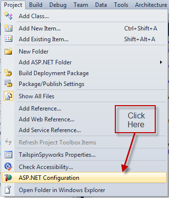
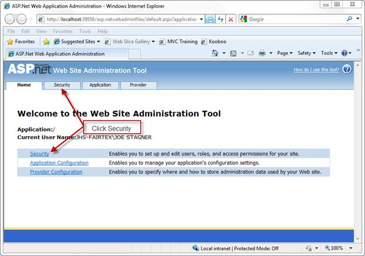
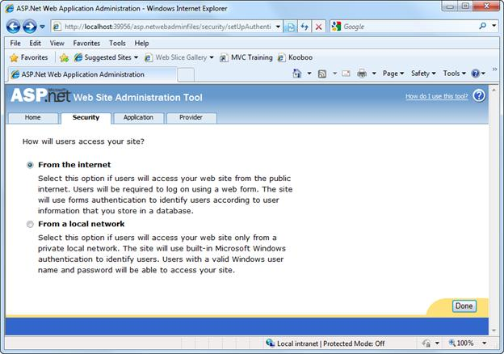
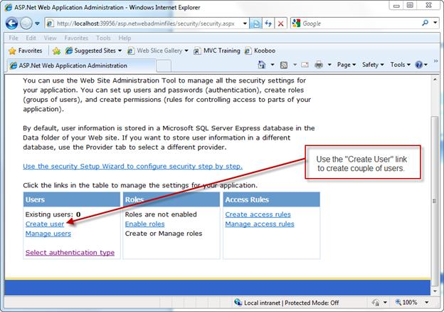
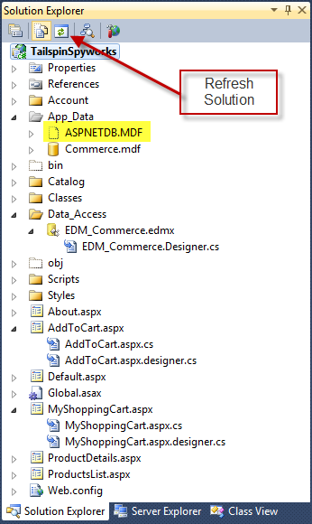

Part 6: ASP.NET Membership
====================
by [Joe Stagner](https://github.com/JoeStagner)

> Tailspin Spyworks demonstrates how extraordinarily simple it is to create powerful, scalable applications for the .NET platform. It shows off how to use the great new features in ASP.NET 4 to build an online store, including shopping, checkout, and administration.
> 
> This tutorial series details all of the steps taken to build the Tailspin Spyworks sample application. Part 6 adds ASP.NET Membership.

##   Working with ASP.NET Membership

Click Security

Make sure that we are using forms authentication.

Use the "Create User" link to create a couple of users.

When done, refer to the Solution Explorer window and refresh the view.

Note that the ASPNETDB.MDF fine has been created. This file contains the tables to support the core ASP.NET services like membership.

Now we can begin implementing the checkout process.

Begin by creating a CheckOut.aspx page.

The CheckOut.aspx page should only be available to users who are logged in so we will restrict access to logged in users and redirect users who are not logged in to the LogIn page.

To do this we'll add the following to the configuration section of our web.config file.

    <location path="Checkout.aspx">
        <system.web>
          <authorization>
            <deny users="?" />
          </authorization>
        </system.web>
      </location>

The template for ASP.NET Web Forms applications automatically added an authentication section to our web.config file and established the default login page.

    <authentication mode="Forms">
          <forms loginUrl="~/Account/Login.aspx" timeout="2880" />
        </authentication>

We must modify the Login.aspx code behind file to migrate an anonymous shopping cart when the user logs in. Change the Page\_Load event as follows.

    using System.Web.Security;
    
    protected void Page_Load(object sender, EventArgs e)
    {
      // If the user is not submitting their credentials
      // save refferer
      if (!Page.IsPostBack)
         {
         if (Page.Request.UrlReferrer != null)
            {
            Session["LoginReferrer"] = Page.Request.UrlReferrer.ToString();
            }
          }
               
      // User is logged in so log them out.
      if (User.Identity.IsAuthenticated)
         {
         FormsAuthentication.SignOut();
         Response.Redirect("~/");
         }
    }

Then add a "LoggedIn" event handler like this to set the session name to the newly logged in user and change the temporary session id in the shopping cart to that of the user by calling the MigrateCart method in our MyShoppingCart class. (Implemented in the .cs file)

    protected void LoginUser_LoggedIn(object sender, EventArgs e)
    {
      MyShoppingCart usersShoppingCart = new MyShoppingCart();
      String cartId = usersShoppingCart.GetShoppingCartId();
      usersShoppingCart.MigrateCart(cartId, LoginUser.UserName);
                
      if(Session["LoginReferrer"] != null)
        {
        Response.Redirect(Session["LoginReferrer"].ToString());
        }
    
      Session["UserName"] = LoginUser.UserName;
    }

Implement the MigrateCart() method like this.

    //--------------------------------------------------------------------------------------+
    public void MigrateCart(String oldCartId, String UserName)
    {
      using (CommerceEntities db = new CommerceEntities())
        {
        try
          {
          var myShoppingCart = from cart in db.ShoppingCarts
                               where cart.CartID == oldCartId
                               select cart;
    
          foreach (ShoppingCart item in myShoppingCart)
            {
            item.CartID = UserName;                 
            }
          db.SaveChanges();
          Session[CartId] = UserName;
          }
        catch (Exception exp)
          {
          throw new Exception("ERROR: Unable to Migrate Shopping Cart - " +     
                               exp.Message.ToString(), exp);
          }
        }           
    }

In checkout.aspx we'll use an EntityDataSource and a GridView in our check out page much as we did in our shopping cart page.

    

      Review and Submit Your Order
    

          
       <asp:Label ID="LabelCartHeader" runat="server" 
                  Text="Please check all the information below to be sure it's correct.">
       </asp:Label>
      
    <asp:GridView ID="MyList" runat="server" AutoGenerateColumns="False" 
                  DataKeyNames="ProductID,UnitCost,Quantity" 
                  DataSourceID="EDS_Cart" 
                  CellPadding="4" GridLines="Vertical" CssClass="CartListItem" 
                  onrowdatabound="MyList_RowDataBound" ShowFooter="True">
      <AlternatingRowStyle CssClass="CartListItemAlt" />
      <Columns>
        <asp:BoundField DataField="ProductID" HeaderText="Product ID" ReadOnly="True" 
                        SortExpression="ProductID"  />
        <asp:BoundField DataField="ModelNumber" HeaderText="Model Number" 
                        SortExpression="ModelNumber" />
        <asp:BoundField DataField="ModelName" HeaderText="Model Name" 
                        SortExpression="ModelName" />
        <asp:BoundField DataField="UnitCost" HeaderText="Unit Cost" ReadOnly="True" 
                        SortExpression="UnitCost" DataFormatString="{0:c}" />
        <asp:BoundField DataField="Quantity" HeaderText="Quantity" ReadOnly="True" 
                        SortExpression="Quantity" />
        <asp:TemplateField> 
          <HeaderTemplate>Item Total</HeaderTemplate>
          <ItemTemplate>
            <%# (Convert.ToDouble(Eval("Quantity")) * Convert.ToDouble(Eval("UnitCost")))%>
          </ItemTemplate>
        </asp:TemplateField>
      </Columns>
      <FooterStyle CssClass="CartListFooter"/>
      <HeaderStyle  CssClass="CartListHead" />
    </asp:GridView>   
        
     
    <asp:imagebutton id="CheckoutBtn" runat="server" ImageURL="Styles/Images/submit.gif" 
                                      onclick="CheckoutBtn_Click">
    </asp:imagebutton>
    <asp:EntityDataSource ID="EDS_Cart" runat="server" 
                          ConnectionString="name=CommerceEntities" 
                          DefaultContainerName="CommerceEntities" 
                          EnableFlattening="False" 
                          EnableUpdate="True" 
                          EntitySetName="ViewCarts" 
                          AutoGenerateWhereClause="True" 
                          EntityTypeFilter="" 
                          Select="" Where="">
       <WhereParameters>
          <asp:SessionParameter Name="CartID" DefaultValue="0" 
                                              SessionField="TailSpinSpyWorks_CartID" />
       </WhereParameters>
    </asp:EntityDataSource>

Note that our GridView control specifies an "ondatabound" event handler named MyList\_RowDataBound so let's implement that event handler like this.

    decimal _CartTotal = 0;
    
    //--------------------------------------------------------------------------------------+
    protected void MyList_RowDataBound(object sender, GridViewRowEventArgs e)
    {
      if (e.Row.RowType == DataControlRowType.DataRow)
         {
         TailspinSpyworks.Data_Access.ViewCart myCart = new Data_Access.ViewCart();
         myCart = (TailspinSpyworks.Data_Access.ViewCart)e.Row.DataItem;
         _CartTotal += myCart.UnitCost * myCart.Quantity;
         }
       else if (e.Row.RowType == DataControlRowType.Footer)
         {
         if (_CartTotal > 0)
            {
            CheckOutHeader.InnerText = "Review and Submit Your Order";
            LabelCartHeader.Text = "Please check all the information below to be sure
                                                                    it's correct.";
            CheckoutBtn.Visible = true;
            e.Row.Cells[5].Text = "Total: " + _CartTotal.ToString("C");
            }
         }
    }

This method keeps a running total of the shopping cart as each row is bound and updates the bottom row of the GridView.

At this stage we have implemented a "review" presentation of the order to be placed.

Let's handle an empty cart scenario by adding a few lines of code to our Page\_Load event:

    protected void Page_Load(object sender, EventArgs e)
    {
       CheckOutHeader.InnerText = "Your Shopping Cart is Empty";
       LabelCartHeader.Text = "";
       CheckoutBtn.Visible = false;
    }

When the user clicks on the "Submit" button we will execute the following code in the Submit Button Click Event handler.

    protected void CheckoutBtn_Click(object sender, ImageClickEventArgs e)
    {
      MyShoppingCart usersShoppingCart = new MyShoppingCart();
      if (usersShoppingCart.SubmitOrder(User.Identity.Name) == true)
        {
        CheckOutHeader.InnerText = "Thank You - Your Order is Complete.";
        Message.Visible = false;
        CheckoutBtn.Visible = false;
        }
      else
        {
        CheckOutHeader.InnerText = "Order Submission Failed - Please try again. ";
        }
    }

The "meat" of the order submission process is to be implemented in the SubmitOrder() method of our MyShoppingCart class.

SubmitOrder will:

- Take all the line items in the shopping cart and use them to create a new Order Record and the associated OrderDetails records.
- Calculate Shipping Date.
- Clear the shopping cart.

    //--------------------------------------------------------------------------------------+
    public bool SubmitOrder(string UserName)
    {
      using (CommerceEntities db = new CommerceEntities())
        {
        try
          {
          //------------------------------------------------------------------------+
          //  Add New Order Record                                                  |
          //------------------------------------------------------------------------+
          Order newOrder = new Order();
          newOrder.CustomerName = UserName;
          newOrder.OrderDate = DateTime.Now;
          newOrder.ShipDate = CalculateShipDate();
          db.Orders.AddObject(newOrder);
          db.SaveChanges();
             
          //------------------------------------------------------------------------+
          //  Create a new OderDetail Record for each item in the Shopping Cart     |
          //------------------------------------------------------------------------+
          String cartId = GetShoppingCartId();
          var myCart = (from c in db.ViewCarts where c.CartID == cartId select c);
          foreach (ViewCart item in myCart)
            {
            int i = 0;
            if (i < 1)
              {
              OrderDetail od = new OrderDetail();
              od.OrderID = newOrder.OrderID;
              od.ProductID = item.ProductID;
              od.Quantity = item.Quantity;
              od.UnitCost = item.UnitCost;
              db.OrderDetails.AddObject(od);
              i++;
              }
    
            var myItem = (from c in db.ShoppingCarts where c.CartID == item.CartID && 
                             c.ProductID == item.ProductID select c).FirstOrDefault();
            if (myItem != null)
              {
              db.DeleteObject(myItem);
              }
            }
          db.SaveChanges();                    
          }
        catch (Exception exp)
          {
          throw new Exception("ERROR: Unable to Submit Order - " + exp.Message.ToString(), 
                                                                   exp);
          }
        } 
      return(true);
    }

For the purposes of this sample application we'll calculate a ship date by simply adding two days to the current date.

    //--------------------------------------------------------------------------------------+
    DateTime CalculateShipDate()
    {
       DateTime shipDate = DateTime.Now.AddDays(2);
       return (shipDate);
    }

Running the application now will permit us to test the shopping process from start to finish.

>[!div class="step-by-step"] [Previous](tailspin-spyworks-part-5.md) [Next](tailspin-spyworks-part-7.md)