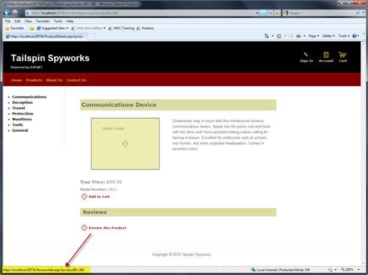
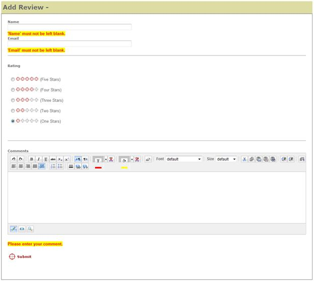
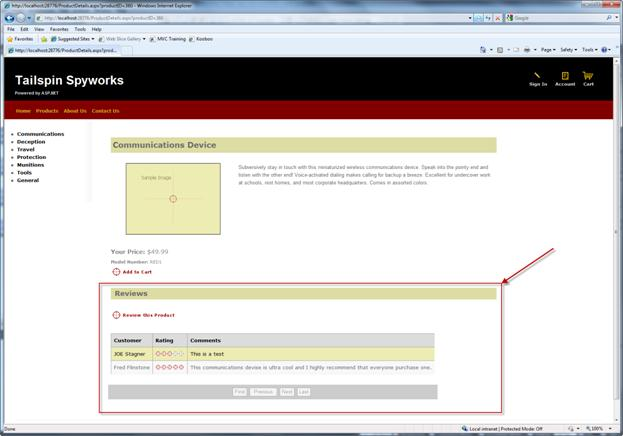
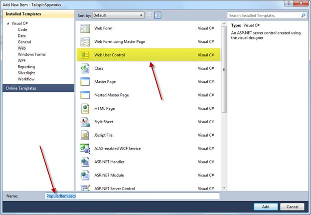
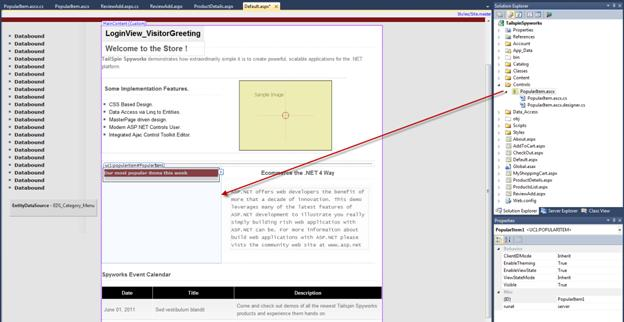
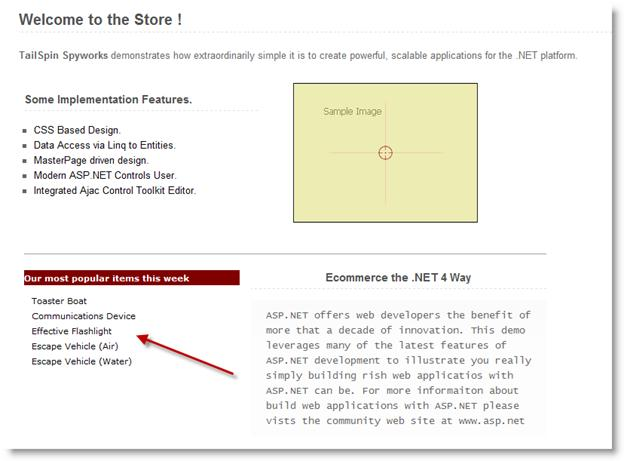
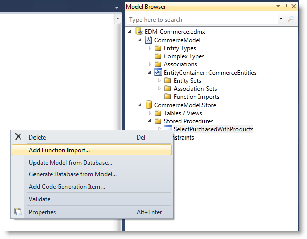
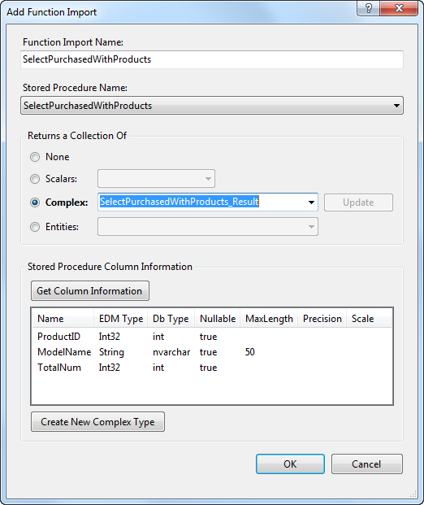
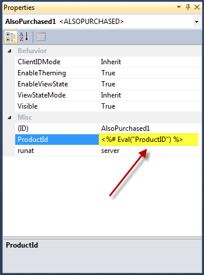
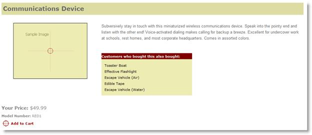

Part 7: Adding Features
====================
by [Joe Stagner](https://github.com/JoeStagner)

> Tailspin Spyworks demonstrates how extraordinarily simple it is to create powerful, scalable applications for the .NET platform. It shows off how to use the great new features in ASP.NET 4 to build an online store, including shopping, checkout, and administration.
> 
> This tutorial series details all of the steps taken to build the Tailspin Spyworks sample application. Part 7 adds additional features, such as account review, product reviews, and "popular items" and "also purchased" user controls.

##   Adding Features

Though users can browse our catalog, place items in their shopping cart, and complete the checkout process, there are a number of supporting features that we will include to improve our site.

1. Account Review (List orders placed and view details.)
2. Add some context specific content to the front page.
3. Add a feature to let users Review the products in the catalog.
4. Create a User Control to display Popular Items and Place that control on the front page.
5. Create an "Also Purchased" user control and add it to the product details page.
6. Add a Contact Page.
7. Add an About Page.
8. Global Error

##   Account Review

In the "Account" folder create two .aspx pages one named OrderList.aspx and the other named OrderDetails.aspx

OrderList.aspx will leverage the GridView and EntityDataSoure controls much as we have previously.

    
Order History
 
    
    <asp:GridView ID="GridView_OrderList" runat="server" AllowPaging="True" 
                  ForeColor="#333333" GridLines="None" CellPadding="4" Width="100%" 
                  AutoGenerateColumns="False" DataKeyNames="OrderID" 
                  DataSourceID="EDS_Orders" AllowSorting="True" ViewStateMode="Disabled" >
      <AlternatingRowStyle BackColor="White" />
      <Columns>
        <asp:BoundField DataField="OrderID" HeaderText="OrderID" ReadOnly="True" 
                        SortExpression="OrderID" />
        <asp:BoundField DataField="CustomerName" HeaderText="Customer" 
                        SortExpression="CustomerName" />
        <asp:BoundField DataField="OrderDate" HeaderText="Order Date" 
                        SortExpression="OrderDate" />
        <asp:BoundField DataField="ShipDate" HeaderText="Ship Date" 
                        SortExpression="ShipDate" />
        <asp:HyperLinkField HeaderText="Show Details" Text="Show Details" 
                     DataNavigateUrlFields="OrderID" 
                     DataNavigateUrlFormatString="~/Account/OrderDetails.aspx?OrderID={0}" />
      </Columns>
      <FooterStyle BackColor="#990000" Font-Bold="True" ForeColor="White" />
      <HeaderStyle BackColor="#990000" Font-Bold="True" ForeColor="White" />
      <PagerStyle BackColor="#FFCC66" ForeColor="#333333" HorizontalAlign="Center" />
      <RowStyle BackColor="#FFFBD6" ForeColor="#333333" />
      <SelectedRowStyle BackColor="#FFCC66" Font-Bold="True" ForeColor="Navy" />
      <SortedAscendingCellStyle BackColor="#FDF5AC" />
      <SortedAscendingHeaderStyle BackColor="#4D0000" />
      <SortedDescendingCellStyle BackColor="#FCF6C0" />
      <SortedDescendingHeaderStyle BackColor="#820000" />
      <SortedAscendingCellStyle BackColor="#FDF5AC"></SortedAscendingCellStyle>
      <SortedAscendingHeaderStyle BackColor="#4D0000"></SortedAscendingHeaderStyle>
      <SortedDescendingCellStyle BackColor="#FCF6C0"></SortedDescendingCellStyle>
      <SortedDescendingHeaderStyle BackColor="#820000"></SortedDescendingHeaderStyle>
    </asp:GridView>
    
    <asp:EntityDataSource ID="EDS_Orders" runat="server" EnableFlattening="False" 
                          AutoGenerateWhereClause="True" 
                          Where="" 
                          OrderBy="it.OrderDate DESC"
                          ConnectionString="name=CommerceEntities"  
                          DefaultContainerName="CommerceEntities" 
                          EntitySetName="Orders" >
       <WhereParameters>
          <asp:SessionParameter Name="CustomerName" SessionField="UserName" />
       </WhereParameters>
    </asp:EntityDataSource>

The EntityDataSoure selects records from the Orders table filtered on the UserName (see the WhereParameter) which we set in a session variable when the user log's in.

Note also these parameters in the HyperlinkField of the GridView:

    DataNavigateUrlFields="OrderID" DataNavigateUrlFormatString="~/Account/OrderDetails.aspx?OrderID={0}"

These specify the link to the Order details view for each product specifying the OrderID field as a QueryString parameter to the OrderDetails.aspx page.

##   OrderDetails.aspx

We will use an EntityDataSource control to access the Orders and a FormView to display the Order data and another EntityDataSource with a GridView to display all the Order's line items.

    <asp:FormView ID="FormView1" runat="server" CellPadding="4" 
                                 DataKeyNames="OrderID" 
                                 DataSourceID="EDS_Order" ForeColor="#333333" Width="250px">
       <FooterStyle BackColor="#990000" Font-Bold="True" ForeColor="White" />
       <HeaderStyle BackColor="#990000" Font-Bold="True" ForeColor="White" />
       <ItemTemplate>
          OrderID : <%# Eval("OrderID") %> 
          CustomerName : <%# Eval("CustomerName") %> 
          Order Date : <%# Eval("OrderDate") %> 
          Ship Date : <%# Eval("ShipDate") %> 
       </ItemTemplate>
       <PagerStyle BackColor="#FFCC66" ForeColor="#333333" HorizontalAlign="Center" />
       <RowStyle BackColor="#FFFBD6" ForeColor="#333333" />
    </asp:FormView>
    <asp:EntityDataSource ID="EDS_Order" runat="server"  EnableFlattening="False" 
                          ConnectionString="name=CommerceEntities" 
                          DefaultContainerName="CommerceEntities" 
                          EntitySetName="Orders" 
                          AutoGenerateWhereClause="True" 
                          Where="" 
                          EntityTypeFilter="" Select="">
       <WhereParameters>
          <asp:QueryStringParameter Name="OrderID" QueryStringField="OrderID" Type="Int32" />
       </WhereParameters>
    </asp:EntityDataSource>
    
    <asp:GridView ID="GridView_OrderDetails" runat="server" 
                  AutoGenerateColumns="False" 
                  DataKeyNames="ProductID,UnitCost,Quantity" 
                  DataSourceID="EDS_OrderDetails" 
                  CellPadding="4" GridLines="Vertical" CssClass="CartListItem" 
                  onrowdatabound="MyList_RowDataBound" ShowFooter="True" 
                  ViewStateMode="Disabled">
       <AlternatingRowStyle CssClass="CartListItemAlt" />
       <Columns>
         <asp:BoundField DataField="ProductID" HeaderText="Product ID" ReadOnly="True" 
                         SortExpression="ProductID"  />
         <asp:BoundField DataField="ModelNumber" HeaderText="Model Number"  
                         SortExpression="ModelNumber" />
         <asp:BoundField DataField="ModelName" HeaderText="Model Name" 
                         SortExpression="ModelName" />
         <asp:BoundField DataField="UnitCost" HeaderText="Unit Cost" ReadOnly="True" 
                         SortExpression="UnitCost" DataFormatString="{0:c}" />
         <asp:BoundField DataField="Quantity" HeaderText="Quantity" ReadOnly="True" 
                         SortExpression="Quantity" />
         <asp:TemplateField> 
           <HeaderTemplate>Item Total</HeaderTemplate>
           <ItemTemplate>
             <%# (Convert.ToDouble(Eval("Quantity")) *  Convert.ToDouble(Eval("UnitCost")))%>
           </ItemTemplate>
         </asp:TemplateField>
       </Columns>
       <FooterStyle CssClass="CartListFooter"/>
       <HeaderStyle  CssClass="CartListHead" />
     </asp:GridView> 
     <asp:EntityDataSource ID="EDS_OrderDetails" runat="server" 
                           ConnectionString="name=CommerceEntities" 
                           DefaultContainerName="CommerceEntities" 
                           EnableFlattening="False" 
                           EntitySetName="VewOrderDetails" 
                           AutoGenerateWhereClause="True" 
                           Where="">
       <WhereParameters>
         <asp:QueryStringParameter Name="OrderID" QueryStringField="OrderID" Type="Int32" />
       </WhereParameters>
    </asp:EntityDataSource>

In the Code Behind file (OrderDetails.aspx.cs) we have two little bits of housekeeping.

First we need to make sure that OrderDetails always gets an OrderId.

    protected void Page_Load(object sender, EventArgs e)
    {
      if (String.IsNullOrEmpty(Request.QueryString["OrderId"]))
         {
         Response.Redirect("~/Account/OrderList.aspx");
         }
    }

We also need to calculate and display the order total from the line items.

    decimal _CartTotal = 0;
    
    protected void MyList_RowDataBound(object sender, GridViewRowEventArgs e)
    {
      if (e.Row.RowType == DataControlRowType.DataRow)
         {
         TailspinSpyworks.Data_Access.VewOrderDetail myCart = new 
                                                            Data_Access.VewOrderDetail();
         myCart = (TailspinSpyworks.Data_Access.VewOrderDetail)e.Row.DataItem;
         _CartTotal += Convert.ToDecimal(myCart.UnitCost * myCart.Quantity);
         }
       else if (e.Row.RowType == DataControlRowType.Footer)
         {
         e.Row.Cells[5].Text = "Total: " + _CartTotal.ToString("C");
       }
    }

##   The Home Page

Let's add some static content to the Default.aspx page.

First I'll create a "Content" folder and within it an Images folder (and I'll include an image to be used on the home page.)

Into the bottom placeholder of the Default.aspx page, add the following markup.

    <h2>
      <asp:LoginView ID="LoginView_VisitorGreeting" runat="server">
        <AnonymousTemplate>
           Welcome to the Store !
        </AnonymousTemplate>
        <LoggedInTemplate>
          Hi <asp:LoginName ID="LoginName_Welcome" runat="server" />. Thanks for coming back. 
        </LoggedInTemplate>
      </asp:LoginView>
    </h2>
    
    
<strong>TailSpin Spyworks</strong> demonstrates how extraordinarily simple it is to create powerful, scalable applications for the .NET platform. 

    <table>
      <tr>
        <td>               
          <h3>Some Implementation Features.</h3>
          <ul>
                    <li><a href="#">CSS Based Design.</a></li>
                    <li><a href="#">Data Access via Linq to Entities.</a></li>
                    <li><a href="#">MasterPage driven design.</a></li>
                    <li><a href="#">Modern ASP.NET Controls User.</a></li>
                    <li><a href="#">Integrated Ajac Control Toolkit Editor.</a></li>
            </ul>
        </td>
        <td>
            
        </td>
      </tr>
    </table>
        
    <table>
      <tr>
        <td colspan="2">
</td>
      </tr>
      <tr>
        <td>               
            <!-- Popular Items -->
        </td>
        <td>  
          
<h3>Ecommerce the .NET 4 Way</h3>

          <blockquote>
            

            ASP.NET offers web developers the benefit of more that a decade of innovation. 
            This   demo leverages many of the latest features of ASP.NET development to     
            illustrate really simply building rich web applications with ASP.NET can be. 
            For more information about build web applications with ASP.NET please visit the 
            community web site at www.asp.net
            

          </blockquote>
        </td>
      </tr>
    </table>
    
    <h3>Spyworks Event Calendar</h3>
    <table>
      <tr class="rowH">
        <th>Date</th>
        <th>Title</th>
        <th>Description</th>
      </tr>
      <tr class="rowA">
        <td>June 01, 2011</td>
        <td>Sed vestibulum blandit</td>
        <td>
        Come and check out demos of all the newest Tailspin Spyworks products and experience 
        them hands on.
        </td>
      </tr>
      <tr class="rowB">
        <td>November 28, 2011</td>
        <td>Spyworks Product Demo</td>
        <td>
        Come and check out demos of all the newest Tailspin Spyworks products and experience 
        them hands on.
        </td>
      </tr>
      <tr class="rowA">
        <td>November 23, 2011</td>
        <td>Spyworks Product Demo</td>
        <td>
         Come and check out demos of all the newest Tailspin Spyworks products and experience 
         them hands on.
        </td>
      </tr>
      <tr class="rowB">
        <td>November 21, 2011</td>
        <td>Spyworks Product Demo</td>
        <td>
        Come and check out demos of all the newest Tailspin Spyworks products and experience 
        them hands on.
        </td>
      </tr>
    </table>

##   Product Reviews

First we'll add a button with a link to a form that we can use to enter a product review.

    
Reviews
 
    <a id="ReviewList_AddReview" href="ReviewAdd.aspx?productID=<%# Eval("ProductID") %>">
       
    </a>

Note that we are passing the ProductID in the query string

Next let's add page named ReviewAdd.aspx

This page will use the ASP.NET AJAC Control Toolkit. If you have not already done so you can download it from here [http://ajaxcontroltoolkit.codeplex.com/](http://ajaxcontroltoolkit.codeplex.com/) and there is guidance on setting up the toolkit for use with Visual Studio here [https://www.asp.net/learn/ajax-videos/video-76.aspx](../../../videos/ajax-control-toolkit/how-do-i-get-started-with-the-aspnet-ajax-control-toolkit.md).

In design mode, drag controls and validators from the toolbox and build a form like the one below.

The markup will look something like this.

    <asp:ToolkitScriptManager ID="ToolkitScriptManager1" runat="server">
    </asp:ToolkitScriptManager>
    
Add Review - <asp:label id="ModelName" runat="server" />

    

      Name 
      <asp:TextBox id="Name" runat="server" Width="400px" /> 
      <asp:RequiredFieldValidator runat="server" id="RequiredFieldValidator1" 
                                  ControlToValidate="Name" 
                                  Display="Dynamic" 
                                  CssClass="ValidationError" 
                                  ErrorMessage="'Name' must not be left blank."  /> 
      Email 
      <asp:TextBox id="Email" runat="server" Width="400px" /> 
      <asp:RequiredFieldValidator runat="server" id="RequiredFieldValidator2" 
                                  ControlToValidate="Email" Display="Dynamic" 
                                  CssClass="ValidationError" 
                                  ErrorMessage="'Email' must not be left blank." />
       
 
      Rating  
      <asp:RadioButtonList ID="Rating" runat="server">
        <asp:ListItem value="5" selected="True" 
                 Text=' (Five Stars) '  />
        <asp:ListItem value="4" selected="True" 
                 Text=' (Four Stars) '  />
        <asp:ListItem value="3" selected="True" 
                 Text=' (Three Stars) '  />
        <asp:ListItem value="2" selected="True" 
                 Text=' (Two Stars) '  />
        <asp:ListItem value="1" selected="True" 
                 Text=' (One Stars) '  />
      </asp:RadioButtonList>
       
 
      Comments 
      <cc1:Editor ID="UserComment" runat="server" />
      <asp:RequiredFieldValidator runat="server" id="RequiredFieldValidator3" 
                                  ControlToValidate="UserComment" Display="Dynamic" 
                                  CssClass="ValidationError" 
                                  ErrorMessage="Please enter your comment." />  
      <asp:ImageButton ImageURL="Styles/Images/submit.gif" runat="server" 
                       id="ReviewAddBtn" onclick="ReviewAddBtn_Click" />
         
    

Now that we can enter reviews, lets display those reviews on the product page.

Add this markup to the ProductDetails.aspx page.

    <asp:ListView ID="ListView_Comments" runat="server" 
                  DataKeyNames="ReviewID,ProductID,Rating" DataSourceID="EDS_CommentsList">
      <ItemTemplate>
        <tr>
          <td><%# Eval("CustomerName") %></td>
          <td>
            .gif' alt="">
             
          </td>
          <td>
            <%# Eval("Comments") %>
          </td>
        </tr>
      </ItemTemplate>
      <AlternatingItemTemplate>
        <tr>
          <td><%# Eval("CustomerName") %></td>
          <td>
            .gif' alt="">
             
          </td>
          <td><%# Eval("Comments") %></td>
        </tr>
      </AlternatingItemTemplate>
       <EmptyDataTemplate>
         <table runat="server">
           <tr><td>There are no reviews yet for this product.</td></tr>
         </table>
      </EmptyDataTemplate>
      <LayoutTemplate>
        <table runat="server">
          <tr runat="server">
            <td runat="server">
              <table ID="itemPlaceholderContainer" runat="server" border="1">
                <tr runat="server">
                  <th runat="server">Customer</th>
                  <th runat="server">Rating</th>
                  <th runat="server">Comments</th>
                 </tr>
                 <tr ID="itemPlaceholder" runat="server"></tr>
               </table>
             </td>
           </tr>
           <tr runat="server">
             <td runat="server">
               <asp:DataPager ID="DataPager1" runat="server">
                 <Fields>
                   <asp:NextPreviousPagerField ButtonType="Button" 
                                               ShowFirstPageButton="True"
                                               ShowLastPageButton="True" />
                 </Fields>
               </asp:DataPager>
             </td>
           </tr>
         </table>
      </LayoutTemplate>
    </asp:ListView>
    <asp:EntityDataSource ID="EDS_CommentsList" runat="server"  EnableFlattening="False" 
                           AutoGenerateWhereClause="True" 
                           EntityTypeFilter="" 
                           Select="" Where=""
                           ConnectionString="name=CommerceEntities" 
                           DefaultContainerName="CommerceEntities" 
                           EntitySetName="Reviews">
       <WhereParameters>
        <asp:QueryStringParameter Name="ProductID" QueryStringField="productID"  
                                                   Type="Int32" />
      </WhereParameters>
    </asp:EntityDataSource>

Running our application now and navigating to a product shows the product information including customer reviews.

##   Popular Items Control (Creating User Controls)

In order to increase sales on your web site we will add a couple of features to "suggestive sell" popular or related products.

The first of these features will be a list of the more popular product in our product catalog.

We will create a "User Control" to display the top selling items on the home page of our application. Since this will be a control, we can use it on any page by simply dragging and dropping the control in Visual Studio's designer onto any page that we like.

In Visual Studio's solutions explorer, right-click on the solution name and create a new directory named "Controls". While it is not necessary to do so, we will help keep our project organized by creating all our user controls in the "Controls" directory.

Right-click on the controls folder and choose "New Item" :

Specify a name for our control of "PopularItems". Note that the file extension for user controls is .ascx not .aspx.

Our Popular Items User control will be defined as follows.

    <%@ OutputCache Duration="3600" VaryByParam="None" %>
    
Our most popular items this week

    

      <asp:Repeater ID="RepeaterItemsList" runat="server">
        <HeaderTemplate></HeaderTemplate>
          <ItemTemplate>               
            <a class='MostPopularItemText' 
               href='ProductDetails.aspx?productID=<%# Eval("ProductId") %>'>
                                                   <%# Eval("ModelName") %></a>               
          </ItemTemplate>
        <FooterTemplate></FooterTemplate>
      </asp:Repeater>
    

Here we're using a method we have not used yet in this application. We're using the repeater control and instead of using a data source control we're binding the Repeater Control to the results of a LINQ to Entities query.

In the code behind of our control we do that as follows.

    using TailspinSpyworks.Data_Access;
    
    protected void Page_Load(object sender, EventArgs e)
    {
      using (CommerceEntities db = new CommerceEntities())
        {
        try
          {
          var query = (from ProductOrders in db.OrderDetails
                            join SelectedProducts in db.Products on ProductOrders.ProductID  
                            equals SelectedProducts.ProductID
                            group ProductOrders by new
                                {
                                ProductId = SelectedProducts.ProductID,
                                ModelName = SelectedProducts.ModelName
                                } into grp
                            select new
                                {
                                ModelName = grp.Key.ModelName,
                                ProductId = grp.Key.ProductId,
                                Quantity = grp.Sum(o => o.Quantity)
                                } into orderdgrp where orderdgrp.Quantity > 0 
                            orderby orderdgrp.Quantity descending select orderdgrp).Take(5);
    
                        RepeaterItemsList.DataSource = query;
                        RepeaterItemsList.DataBind(); 
          }
        catch (Exception exp)
          {
          throw new Exception("ERROR: Unable to Load Popular Items - " + 
                               exp.Message.ToString(), exp);
          }
        }
    }

Note also this important line at the top of our control's markup.

    <%@ OutputCache Duration="3600" VaryByParam="None" %>

Since the most popular items won't be changing on a minute to minute basis we can add a aching directive to improve the performance of our application. This directive will cause the controls code to only be executed when the cached output of the control expires. Otherwise, the cached version of the control's output will be used.

Now all we have to do is include our new control in our Default.aspc page.

Use drag and drop to place an instance of the control in the open column of our Default form.

Now when we run our application the home page displays the most popular items.

##   "Also Purchased" Control (User Controls with Parameters)

The second User Control that we'll create will take suggestive selling to the next level by adding context specificity.

The logic to calculate the top "Also Purchased" items is non-trivial.

Our "Also Purchased" control will select the OrderDetails records (previously purchased) for the currently selected ProductID and grab the OrderIDs for each unique order that is found.

Then we will select al the products from all those Orders and sum the quantities purchased. We'll sort the products by that quantity sum and display the top five items.

Given the complexity of this logic, we will implement this algorithm as a stored procedure.

The T-SQL for the stored procedure is as follows.

    ALTER PROCEDURE dbo.SelectPurchasedWithProducts
     @ProductID int
    AS
            SELECT  TOP 5 
        OrderDetails.ProductID,
        Products.ModelName,
        SUM(OrderDetails.Quantity) as TotalNum
    
    FROM    
        OrderDetails
      INNER JOIN Products ON OrderDetails.ProductID = Products.ProductID
    
    WHERE   OrderID IN 
    (
        /* This inner query should retrieve all orders that have contained the productID */
        SELECT DISTINCT OrderID 
        FROM OrderDetails
        WHERE ProductID = @ProductID
    )
    AND OrderDetails.ProductID != @ProductID 
    
    GROUP BY OrderDetails.ProductID, Products.ModelName 
    
    ORDER BY TotalNum DESC
    RETURN

Note that this stored procedure (SelectPurchasedWithProducts) existed in the database when we included it in our application and when we generated the Entity Data Model we specified that, in addition to the Tables and Views that we needed, the Entity Data Model should include this stored procedure.

To access the stored procedure from the Entity Data Model we need to import the function.

Double Click on the Entity Data Model in the Solutions Explorer to open it in the designer and open the Model Browser, then right-click in the designer and select "Add Function Import".

Doing so will open this dialog.

Fill out the fields as you see above, selecting the "SelectPurchasedWithProducts" and use the procedure name for the name of our imported function.

Click "Ok".

Having done this we can simply program against the stored procedure as we might any other item in the model.

So, in our "Controls" folder create a new user control named AlsoPurchased.ascx.

The markup for this control will look very familiar to the PopularItems control.

    

    

    <asp:Label ID="LabelTitle" runat="server" Text=" Customers who bought this also bought:"></asp:Label>

    

        <asp:Repeater ID="RepeaterItemsList" runat="server">
           <HeaderTemplate></HeaderTemplate>
              <ItemTemplate>               
                 <a class='MostPopularItemText' href='ProductDetails.aspx?productID=<%# Eval("ProductId") %>'><%# Eval("ModelName") %></a>               
              </ItemTemplate>
           <FooterTemplate></FooterTemplate>
        </asp:Repeater>
    

    

The notable difference is that are not caching the output since the item's to be rendered will differ by product.

The ProductId will be a "property" to the control.

    private int _ProductId;
    
    public int ProductId
    {
    get { return _ProductId ; }
    set { _ProductId = Convert.ToInt32(value); }
    }

In the control's PreRender event handler we eed to do three things.

1. Make sure the ProductID is set.
2. See if there are any products that have been purchased with the current one.
3. Output some items as determined in #2.

Note how easy it is to call the stored procedure through the model.

    //--------------------------------------------------------------------------------------+
    protected void Page_PreRender(object sender, EventArgs e)
    {
      if (_ProductId < 1)
         {
         // This should never happen but we could expand the use of this control by reducing 
         // the dependency on the query string by selecting a few RANDOME products here. 
         Debug.Fail("ERROR : The Also Purchased Control Can not be used without 
                             setting the ProductId.");
         throw new Exception("ERROR : It is illegal to load the AlsoPurchased COntrol 
                                      without setting a ProductId.");
         }
          
      int ProductCount = 0;
      using (CommerceEntities db = new CommerceEntities())
        {
        try
          {
          var v = db.SelectPurchasedWithProducts(_ProductId);
          ProductCount = v.Count();
          }
        catch (Exception exp)
          {
          throw new Exception("ERROR: Unable to Retrieve Also Purchased Items - " + 
                                      exp.Message.ToString(), exp);
          }
        }
    
      if (ProductCount > 0)
         {
         WriteAlsoPurchased(_ProductId);              
         }
      else
         {
         WritePopularItems();
         }
    }

After determining that there ARE "also purchased" we can simply bind the repeater to the results returned by the query.

    //-------------------------------------------------------------------------------------+
    private void WriteAlsoPurchased(int currentProduct)
    {
      using (CommerceEntities db = new CommerceEntities())
            {
            try
              {
              var v = db.SelectPurchasedWithProducts(currentProduct);
              RepeaterItemsList.DataSource = v;
              RepeaterItemsList.DataBind();
              }
             catch (Exception exp)
              {
              throw new Exception("ERROR: Unable to Write Also Purchased - " + 
                                                              exp.Message.ToString(), exp);
              }
            }
    }

If there were not any "also purchased" items we'll simply display other popular items from our catalog.

    //--------------------------------------------------------------------------------------+
    private void WritePopularItems()
    {
      using (CommerceEntities db = new CommerceEntities())
        {
        try
          {
          var query = (from ProductOrders in db.OrderDetails
                       join SelectedProducts in db.Products on ProductOrders.ProductID 
                       equals SelectedProducts.ProductID
                       group ProductOrders by new
                             {
                             ProductId = SelectedProducts.ProductID,
                             ModelName = SelectedProducts.ModelName
                             } into grp
                       select new
                             {
                             ModelName = grp.Key.ModelName,
                             ProductId = grp.Key.ProductId,
                             Quantity = grp.Sum(o => o.Quantity)
                             } into orderdgrp
                       where orderdgrp.Quantity > 0
                       orderby orderdgrp.Quantity descending
                       select orderdgrp).Take(5);
                       
          LabelTitle.Text = "Other items you might be interested in: ";
          RepeaterItemsList.DataSource = query;
          RepeaterItemsList.DataBind();
          }
        catch (Exception exp)
          {
          throw new Exception("ERROR: Unable to Load Popular Items - " + 
                                                            exp.Message.ToString(), exp);
          }
        }
    }

To view the "Also Purchased" items, open the ProductDetails.aspx page and drag the AlsoPurchased control from the Solutions Explorer so that it appears in this position in the markup.

    <table  border="0">
      <tr>
         <td>
           '  border="0" 
                                                       alt='<%# Eval("ModelName") %>' />
         </td>
         <td><%# Eval("Description") %>     
             <uc1:AlsoPurchased ID="AlsoPurchased1" runat="server" />                 
         </td>
       </tr>
    </table>

Doing so will create a reference to the control at the top of the ProductDetails page.

    <%@ Register src="Controls/AlsoPurchased.ascx" tagname="AlsoPurchased" tagprefix="uc1" %>

Since the AlsoPurchased user control requires a ProductId number we will set the ProductID property of our control by using an Eval statement against the current data model item of the page.

When we build and run now and browse to a product we see the "Also Purchased" items.

>[!div class="step-by-step"] [Previous](tailspin-spyworks-part-6.md) [Next](tailspin-spyworks-part-8.md)