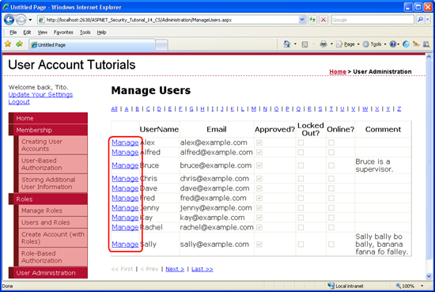
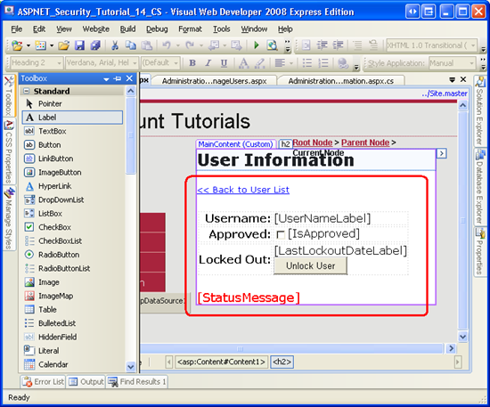
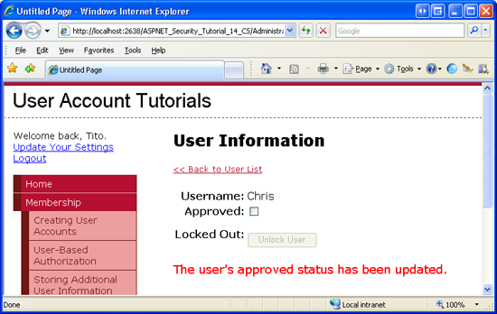
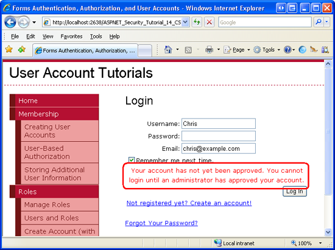
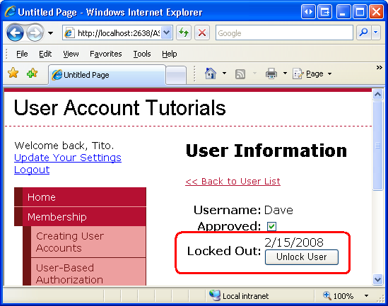
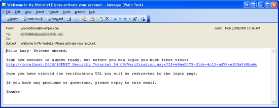
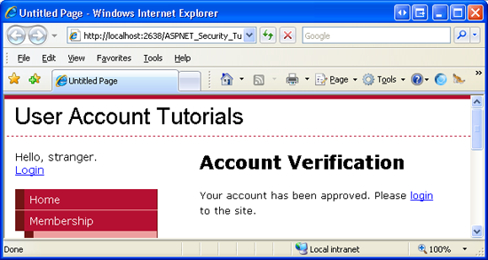

Unlocking and Approving User Accounts (C#)
====================
by [Scott Mitchell](https://twitter.com/ScottOnWriting)

[Download Code](http://download.microsoft.com/download/6/0/e/60e1bd94-e5f9-4d5a-a079-f23c98f4f67d/CS.14.zip) or [Download PDF](http://download.microsoft.com/download/6/0/e/60e1bd94-e5f9-4d5a-a079-f23c98f4f67d/aspnet_tutorial14_UnlockAndApprove_cs.pdf)

> This tutorial shows how to build a web page for administrators to manage users' locked out and approved statuses. We will also see how to approve new users only after they have verified their email address.

## Introduction

Along with a username, password, and email, each user account has two status fields that dictate whether the user can log into the site: locked out and approved. A user is automatically locked out if they provide invalid credentials a specified number of times within a specified number of minutes (the default settings lock a user out after 5 invalid login attempts within 10 minutes). The approved status is useful in scenarios where some action must transpire before a new user is able to log on to the site. For example, a user might need to first verify their email address or be approved by an administrator before being able to login.

Because a locked out or unapproved user cannot login, it's only natural to wonder how these statuses can be reset. ASP.NET does not include any built-in functionality or Web controls for managing users' locked out and approved statuses, in part because these decisions need to be handled on a site-by-site basis. Some sites might automatically approve all new user accounts (the default behavior). Others have an administrator approve new accounts or do not approve users until they visit a link sent to the email address provided when they signed up. Likewise, some sites may lock out users until an administrator resets their status, while other sites send an email to the locked out user with a URL they can visit to unlock their account.

This tutorial shows how to build a web page for administrators to manage users' locked out and approved statuses. We will also see how to approve new users only after they have verified their email address.

## Step 1: Managing Users' Locked Out and Approved Statuses

In the [*Building an Interface to Select One User Account from Many*](building-an-interface-to-select-one-user-account-from-many-cs.md) tutorial we constructed a page that listed each user account in a paged, filtered GridView. The grid lists each user's name and email, their approved and locked out statuses, whether they're currently online, and any comments about the user. To manage users' approved and locked out statuses, we could make this grid editable. To change a user's approved status, the administrator would first locate the user account and then edit the corresponding GridView row, checking or unchecking the approved checkbox. Alternatively, we could manage the approved and locked out statuses through a separate ASP.NET page.

For this tutorial let's use two ASP.NET pages: `ManageUsers.aspx` and `UserInformation.aspx`. The idea here is that `ManageUsers.aspx` lists the user accounts in the system, while `UserInformation.aspx` enables the administrator to manage the approved and locked out statuses for a specific user. Our first order of business is to augment the GridView in `ManageUsers.aspx` to include a HyperLinkField, which renders as a column of links. We want each link to point to `UserInformation.aspx?user=UserName`, where *UserName* is the name of the user to edit.

> [!NOTE] If you downloaded the code for the [*Recovering and Changing Passwords*](recovering-and-changing-passwords-cs.md) tutorial you may have noticed that the `ManageUsers.aspx` page already contains a set of "Manage" links and the `UserInformation.aspx` page provides an interface for changing the selected user's password. I decided not to replicate that functionality in the code associated with this tutorial because it worked by circumventing the Membership API and operating directly with the SQL Server database to change a user's password. This tutorial starts from scratch with the `UserInformation.aspx` page.

### Adding "Manage" Links to the`UserAccounts`GridView

Open the `ManageUsers.aspx` page and add a HyperLinkField to the `UserAccounts` GridView. Set the HyperLinkField's `Text` property to "Manage" and its `DataNavigateUrlFields` and `DataNavigateUrlFormatString` properties to `UserName` and "UserInformation.aspx?user={0}", respectively. These settings configure the HyperLinkField such that all of the hyperlinks display the text "Manage", but each link passes in the appropriate *UserName* value into the querystring.

After adding the HyperLinkField to the GridView, take a moment to view the `ManageUsers.aspx` page through a browser. As Figure 1 shows, each GridView row now includes a "Manage" link. The "Manage" link for Bruce points to `UserInformation.aspx?user=Bruce`, whereas the "Manage" link for Dave points to `UserInformation.aspx?user=Dave`.

**Figure 1**: The HyperLinkField Adds a "Manage" Link for Each User Account  ([Click to view full-size image](unlocking-and-approving-user-accounts-cs/_static/image3.png))

We will create the user interface and code for the `UserInformation.aspx` page in a moment, but first let's talk about how to programmatically change a user's locked out and approved statuses. The [`MembershipUser` class](https://msdn.microsoft.com/en-us/library/system.web.security.membershipuser.aspx) has [`IsLockedOut`](https://msdn.microsoft.com/en-us/library/system.web.security.membershipuser.islockedout.aspx) and [`IsApproved` properties](https://msdn.microsoft.com/en-us/library/system.web.security.membershipuser.isapproved.aspx). The `IsLockedOut` property is read-only. There is no mechanism to programmatically lock out a user; to unlock a user, use the `MembershipUser` class's [`UnlockUser` method](https://msdn.microsoft.com/en-us/library/system.web.security.membershipuser.unlockuser.aspx). The `IsApproved` property is readable and writeable. To save any changes to this property, we need to call the `Membership` class's [`UpdateUser` method](https://msdn.microsoft.com/en-us/library/system.web.security.membership.updateuser.aspx), passing in the modified `MembershipUser` object.

Because the `IsApproved` property is readable and writeable, a CheckBox control is probably the best user interface element for configuring this property. However, a CheckBox will not work for the `IsLockedOut` property because an administrator cannot lock out a user, she may only unlock a user. A suitable user interface for the `IsLockedOut` property is a Button that, when clicked, unlocks the user account. This Button should only be enabled if the user is locked out.

### Creating the`UserInformation.aspx`Page

We are now ready to implement the user interface in `UserInformation.aspx`. Open this page and add the following Web controls:

- A HyperLink control that, when clicked, returns the administrator to the `ManageUsers.aspx` page.
- A Label Web control for displaying the selected user's name. Set this Label's `ID` to `UserNameLabel` and clear out its `Text` property.
- A CheckBox control named `IsApproved`. Set its `AutoPostBack` property to `true`.
- A Label control for displaying the user's last locked out date. Name this Label `LastLockedOutDateLabel` and clear out its `Text` property.
- A Button for unlocking the user. Name this Button `UnlockUserButton` and set its `Text` property to "Unlock User".
- A Label control for displaying status messages, such as, "The user's approved status has been updated." Name this control `StatusMessage`, clear out its `Text` property, and set its `CssClass` property to `Important`. (The `Important` CSS class is defined in the `Styles.css` stylesheet file; it displays the corresponding text in a large, red font.)

After adding these controls, the Design view in Visual Studio should look similar to the screen shot in Figure 2.

**Figure 2**: Create the User Interface for `UserInformation.aspx` ([Click to view full-size image](unlocking-and-approving-user-accounts-cs/_static/image6.png))

With the user interface complete, our next task is to set the `IsApproved` CheckBox and other controls based on the selected user's information. Create an event handler for the page's `Load` event and add the following code:

[!code[Main](unlocking-and-approving-user-accounts-cs/samples/sample1.xml)]

The above code starts by ensuring that this is the first visit to the page and not a subsequent postback. It then reads the username passed through the `user` querystring field and retrieves information about that user account via the `Membership.GetUser(username)` method. If no username was supplied through the querystring, or if the specified user could not be found, the administrator is sent back to the `ManageUsers.aspx` page.

The `MembershipUser` object's `UserName` value is then displayed in the `UserNameLabel` and the `IsApproved` CheckBox is checked based on the `IsApproved` property value.

The `MembershipUser` object's [`LastLockoutDate` property](https://msdn.microsoft.com/en-us/library/system.web.security.membershipuser.lastlockoutdate.aspx) returns a `DateTime` value indicating when the user was last locked out. If the user has never been locked out, the value returned depends on the Membership provider. When a new account is created, the `SqlMembershipProvider` sets the `aspnet_Membership` table's `LastLockoutDate` field to `1754-01-01 12:00:00 AM`. The above code displays an empty string in the `LastLockoutDateLabel` if the `LastLockoutDate` property occurs before year 2000; otherwise, the date portion of the `LastLockoutDate` property is displayed in the Label. The `UnlockUserButton'` s `Enabled` property is set to the user's locked out status, meaning that this Button will only be enabled if the user is locked out.

Take a moment to test the `UserInformation.aspx` page through a browser. You will, of course, need to start at `ManageUsers.aspx` and select a user account to manage. Upon arriving at `UserInformation.aspx`, note that the `IsApproved` CheckBox is only checked if the user is approved. If the user has ever been locked out, their last locked out date is displayed. The Unlock User button is enabled only if the user is currently locked out. Checking or unchecking the `IsApproved` CheckBox or clicking the Unlock User button causes a postback, but no modifications are made to the user account because we've yet to create event handlers for these events.

Return to Visual Studio and create event handlers for the `IsApproved` CheckBox's `CheckedChanged` event and the `UnlockUser` Button's `Click` event. In the `CheckedChanged` event handler, set the user's `IsApproved` property to the `Checked` property of the CheckBox and then save the changes via a call to `Membership.UpdateUser`. In the `Click` event handler, simply call the `MembershipUser` object's `UnlockUser` method. In both event handlers, display a suitable message in the `StatusMessage` Label.

[!code[Main](unlocking-and-approving-user-accounts-cs/samples/sample2.xml)]

### Testing the`UserInformation.aspx`Page

With these event handlers in place, revisit the page and unapproved a user. As Figure 3 shows, you should see a brief message on the page indicating that the user's `IsApproved` property was successfully modified.

**Figure 3**: Chris has been Unapproved  ([Click to view full-size image](unlocking-and-approving-user-accounts-cs/_static/image9.png))

Next, logout and try to login as the user whose account was just unapproved. Because the user is not approved, they cannot login. By default, the Login control displays the same message if the user cannot login, regardless of the reason. But in the [*Validating User Credentials Against the Membership User Store*](../membership/validating-user-credentials-against-the-membership-user-store-cs.md) tutorial we looked at enhancing the Login control to display a more appropriate message. As Figure 4 shows, Chris is shown a message explaining that he cannot login because his account is not yet approved.

**Figure 4**: Chris Cannot Login Because His Account is Unapproved  ([Click to view full-size image](unlocking-and-approving-user-accounts-cs/_static/image12.png))

To test the locked out functionality, attempt to login as an approved user, but use an incorrect password. Repeat this process the necessary number of times until the user's account has been locked out. The Login control was also updated to show a custom message if attempting to login from a locked out account. You know that an account has been locked out once you start seeing the following message at the login page: "Your account has been locked out because of too many invalid login attempts. Please contact the administrator to have your account unlocked."

Return to the `ManageUsers.aspx` page and click the Manage link for the locked out user. As Figure 5 shows, you should see a value in the `LastLockedOutDateLabel` the Unlock User button should be enabled. Click the Unlock User button to unlock the user account. Once you have unlocked the user, they will be able to login again.

**Figure 5**: Dave Has Been Locked Out of the System  ([Click to view full-size image](unlocking-and-approving-user-accounts-cs/_static/image15.png))

## Step 2: Specifying New Users' Approved Status

The approved status is useful in scenarios where you want some action to be performed before a new user is able to login and access the user-specific features of the site. For example, you may be running a private website where all pages, except for the login and signup pages, are accessible only to authenticated users. But what happens if a stranger reaches your website, finds the signup page, and creates an account? To prevent this from happening you could move the signup page to an `Administration` folder, and require that an administrator manually create each account. Alternatively, you could allow anyone to signup, but prohibit site access until an administrator approves the user account.

By default, the CreateUserWizard control approves new accounts. You can configure this behavior using the control's [`DisableCreatedUser` property](https://msdn.microsoft.com/en-gb/library/system.web.ui.webcontrols.createuserwizard.disablecreateduser.aspx). Set this property to `true` to not approve new user accounts.

> [!NOTE] By default the CreateUserWizard control automatically logs on the new user account. This behavior is dictated by the control's [`LoginCreatedUser` property](https://msdn.microsoft.com/en-gb/library/system.web.ui.webcontrols.createuserwizard.logincreateduser.aspx). Because unapproved users cannot login to the site, when `DisableCreatedUser` is `true` the new user account is not logged into the site, regardless of the value of the `LoginCreatedUser` property.

If you are programmatically creating new user accounts via the `Membership.CreateUser` method, to create an unapproved user account use one of the overloads that accept the new user's `IsApproved` property value as an input parameter.

## Step 3: Approving Users By Verifying their Email Address

Many websites that support user accounts do not approve new users until they verify the email address they supplied when registering. This verification process is commonly used to thwart bots, spammers, and other ne'er-do-wells as it requires a unique, verified email address and adds an extra step in the signup process. With this model, when a new user signs up they are sent an email message that includes a link to a verification page. By visiting the link the user has proven that they received the email and, therefore, that the email address provided is valid. The verification page is responsible for approving the user. This may happen automatically, thereby approving any user who reaches this page, or only after the user provides some additional information, such as a [CAPTCHA](http://en.wikipedia.org/wiki/Captcha).

To accommodate this workflow, we need to first update the account creation page so that new users are unapproved. Open the `EnhancedCreateUserWizard.aspx` page in the `Membership` folder and set the CreateUserWizard control's `DisableCreatedUser` property to `true`.

Next, we need to configure the CreateUserWizard control to send an email to the new user with instructions on how to verify their account. In particular, we will include a link in the email to the `Verification.aspx` page (which we've yet to create), passing in the new user's `UserId` through the querystring. The `Verification.aspx` page will lookup the specified user and mark them approved.

### Sending a Verification Email to New Users

To send an email from the CreateUserWizard control, configure its `MailDefinition` property appropriately. As discussed in the [previous tutorial](recovering-and-changing-passwords-cs.md), the ChangePassword and PasswordRecovery controls include a [`MailDefinition` property](https://msdn.microsoft.com/en-us/library/system.web.ui.webcontrols.createuserwizard.maildefinition.aspx) that works in the same manner as the CreateUserWizard control's.

> [!NOTE] To use the `MailDefinition` property you need to specify mail delivery options in `Web.config`. For more information, refer to [Sending Email in ASP.NET](http://aspnet.4guysfromrolla.com/articles/072606-1.aspx).

Start by creating a new email template named `CreateUserWizard.txt` in the `EmailTemplates` folder. Use the following text for the template:

[!code[Main](unlocking-and-approving-user-accounts-cs/samples/sample3.xml)]

Set the `MailDefinition'` s `BodyFileName` property to "~/EmailTemplates/CreateUserWizard.txt" and its `Subject` property to "Welcome to My Website! Please activate your account."

Note that the `CreateUserWizard.txt` email template includes a `<%VerificationUrl%>` placeholder. This is where the URL for the `Verification.aspx` page will be placed. The CreateUserWizard automatically replaces the `<%UserName%>` and `<%Password%>` placeholders with the new account's username and password, but there is no built-in `<%VerificationUrl%>` placeholder. We need to manually replace it with the appropriate verification URL.

To accomplish this, create an event handler for the CreateUserWizard's [`SendingMail` event](https://msdn.microsoft.com/en-us/library/system.web.ui.webcontrols.createuserwizard.sendingmail.aspx) and add the following code:

[!code[Main](unlocking-and-approving-user-accounts-cs/samples/sample4.xml)]

The `SendingMail` event fires after the `CreatedUser` event, meaning that by the time the above event handler executes the new user account has already been created. We can access the new user's `UserId` value by calling the `Membership.GetUser` method, passing in the `UserName` entered into the CreateUserWizard control. Next, the verification URL is formed. The statement `Request.Url.GetLeftPart(UriPartial.Authority)` returns the `http://yourserver.com` portion of the URL; `Request.ApplicationPath` returns path where the application is rooted. The verification URL is then defined as `Verification.aspx?ID=userId`. These two strings are then concatenated to form the complete URL. Finally, the email message body (`e.Message.Body`) has all occurrences of `<%VerificationUrl%>` replaced with the full URL.

The net effect is that new users are unapproved, meaning that they cannot log into the site. Furthermore, they are automatically sent an email with a link to the verification URL (see Figure 6).

**Figure 6**: The New User Receives an Email with a Link to the Verification URL  ([Click to view full-size image](unlocking-and-approving-user-accounts-cs/_static/image18.png))

> [!NOTE] The CreateUserWizard control's default CreateUserWizard step displays a message informing the user their account has been created and displays a Continue button. Clicking this takes the user to the URL specified by the control's `ContinueDestinationPageUrl` property. The CreateUserWizard in `EnhancedCreateUserWizard.aspx` is configured to send new users to the `~/Membership/AdditionalUserInfo.aspx`, which prompts the user for their hometown, homepage URL, and signature. Because this information can only be added by logged on users, it makes sense to update this property to send users back to the site's homepage (`~/Default.aspx`). Moreover, the `EnhancedCreateUserWizard.aspx` page or the CreateUserWizard step should be augmented to inform the user that they have been sent a verification email and their account won't be activated until they follow the instructions in this email. I leave these modifications as an exercise for the reader.

### Creating the Verification Page

Our final task is to create the `Verification.aspx` page. Add this page to the root folder, associating it with the `Site.master` master page. As we've done with most of the previous content pages added to the site, remove the Content control that references the `LoginContent` ContentPlaceHolder so that the content page uses the master page's default content.

Add a Label Web control to the `Verification.aspx` page, set its `ID` to `StatusMessage` and clear out its text property. Next, create the `Page_Load` event handler and add the following code:

[!code[Main](unlocking-and-approving-user-accounts-cs/samples/sample5.xml)]

The bulk of the above code verifies that the `UserId` supplied through the querystring exists, that it is a valid `Guid` value, and that it references an existing user account. If all of these checks pass, the user account is approved; otherwise, a suitable status message is displayed.

Figure 7 shows the `Verification.aspx` page when visited through a browser.

**Figure 7**: The New User's Account is Now Approved  ([Click to view full-size image](unlocking-and-approving-user-accounts-cs/_static/image21.png))

## Summary

All Membership user accounts have two statuses that determine whether the user can log into the site: `IsLockedOut` and `IsApproved`. Both of these properties must be `true` for the user to login.

The user's locked out status is used as a security measure to reduce the likelihood of a hacker breaking into a site through brute force methods. Specifically, a user is locked out if there are a certain number of invalid login attempts within a certain window of time. These bounds are configurable through the Membership provider settings in `Web.config`.

The approved status is commonly used as a means to prohibit new users from logging in until some action has transpired. Perhaps the site requires that new accounts first be approved by the administrator or, as we saw in Step 3, by verifying their email address.

Happy Programming!

### About the Author

Scott Mitchell, author of multiple ASP/ASP.NET books and founder of 4GuysFromRolla.com, has been working with Microsoft Web technologies since 1998. Scott works as an independent consultant, trainer, and writer. His latest book is *[Sams Teach Yourself ASP.NET 2.0 in 24 Hours](https://www.amazon.com/exec/obidos/ASIN/0672327384/4guysfromrollaco)*. Scott can be reached at [mitchell@4guysfromrolla.com](mailto:mitchell@4guysfromrolla.com) or via his blog at [http://ScottOnWriting.NET](http://scottonwriting.net/).

### Special Thanks To…

This tutorial series was reviewed by many helpful reviewers. Interested in reviewing my upcoming MSDN articles? If so, drop me a line at [mitchell@4GuysFromRolla.com](mailto:mitchell@4GuysFromRolla.com)

>[!div class="step-by-step"]
[Previous](recovering-and-changing-passwords-cs.md)
[Next](building-an-interface-to-select-one-user-account-from-many-vb.md)