Assigning Roles to Users (VB)
====================
by [Scott Mitchell](https://twitter.com/ScottOnWriting)

[Download Code](http://download.microsoft.com/download/6/0/3/6032582f-360d-4739-b935-38721fdb86ea/VB.10.zip) or [Download PDF](http://download.microsoft.com/download/6/0/3/6032582f-360d-4739-b935-38721fdb86ea/aspnet_tutorial10_AssigningRoles_vb.pdf)

> In this tutorial we will build two ASP.NET pages to assist with managing what users belong to what roles. The first page will include facilities to see what users belong to a given role, what roles a particular user belongs to, and the ability to assign or remove a particular user from a particular role. In the second page we will augment the CreateUserWizard control so that it includes a step to specify what roles the newly created user belongs to. This is useful in scenarios where an administrator is able to create new user accounts.

## Introduction

The [previous tutorial](creating-and-managing-roles-vb.md) examined the Roles framework and the `SqlRoleProvider`; we saw how to use the `Roles` class to create, retrieve, and delete roles. In addition to creating and deleting roles, we need to be able to assign or remove users from a role. Unfortunately, ASP.NET does not ship with any Web controls for managing what users belong to what roles. Instead, we must create our own ASP.NET pages to manage these associations. The good news is that adding and removing users to roles is quite easy. The `Roles` class contains a number of methods for adding one or more users to one or more roles.

In this tutorial we will build two ASP.NET pages to assist with managing what users belong to what roles. The first page will include facilities to see what users belong to a given role, what roles a particular user belongs to, and the ability to assign or remove a particular user from a particular role. In the second page we will augment the CreateUserWizard control so that it includes a step to specify what roles the newly created user belongs to. This is useful in scenarios where an administrator is able to create new user accounts.

Let's get started!

## Listing What Users Belong To What Roles

The first order of business for this tutorial is to create a web page from which users can be assigned to roles. Before we concern ourselves with how to assign users to roles, let's first concentrate on how to determine what users belong to what roles. There are two ways to display this information: "by role" or "by user." We could allow the visitor to select a role and then show them all of the users that belong to the role (the "by role" display), or we could prompt the visitor to select a user and then show them the roles assigned to that user (the "by user" display).

The "by role" view is useful in circumstances where the visitor wants to know the set of users that belong to a particular role; the "by user" view is ideal when the visitor needs to know a particular user's role(s). Let's have our page include both "by role" and "by user" interfaces.

We will start with creating the "by user" interface. This interface will consist of a drop-down list and a list of checkboxes. The drop-down list will be populated with the set of users in the system; the checkboxes will enumerate the roles. Selecting a user from the drop-down list will check those roles the user belongs to. The person visiting the page can then check or uncheck the checkboxes to add or remove the selected user from the corresponding roles.

> [!NOTE] Using a drop-down list to list the user accounts is not an ideal choice for websites where there may be hundreds of user accounts. A drop-down list is designed to allow a user to pick one item from a relatively short list of options. It quickly becomes unwieldy as the number of list items grows. If you are building a website that will have potentially large numbers of user accounts, you may want to consider using an alternative user interface, such as a pageable GridView or a filterable interface that lists prompts the visitor to choose a letter and then only shows those users whose username starts with the selected letter.

## Step 1: Building the "By User" User Interface

Open the `UsersAndRoles.aspx` page. At the top of the page, add a Label Web control named `ActionStatus` and clear out its `Text` property. We will use this Label to provide feedback on the actions performed, displaying messages like, "User Tito has been added to the Administrators role," or "User Jisun has been removed from the Supervisors role." In order to make these messages stand out, set the Label's `CssClass` property to "Important".

    
 
         <asp:Label ID="ActionStatus" runat="server" CssClass="Important"> </asp:Label> 
    

Next, add the following CSS class definition to the `Styles.css` stylesheet:

    .Important 
    { 
         font-size: large; 
         color: Red; 
    }

This CSS definition instructs the browser to display the Label using a large, red font. Figure 1 shows this effect through the Visual Studio Designer.

[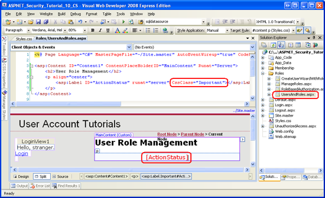](assigning-roles-to-users-vb/_static/image1.png)

**Figure 1**: The Label's `CssClass` Property Results in a Large, Red Font  ([Click to view full-size image](assigning-roles-to-users-vb/_static/image3.png))

Next, add a DropDownList to the page, set its `ID` property to `UserList`, and set its `AutoPostBack` property to True. We will use this DropDownList to list all of the users in the system. This DropDownList will be bound to a collection of MembershipUser objects. Because we want the DropDownList to display the UserName property of the MembershipUser object (and use it as the value of the list items), set the DropDownList's `DataTextField` and `DataValueField` properties to "UserName".

Underneath the DropDownList, add a Repeater named `UsersRoleList`. This Repeater will list all of the roles in the system as a series of checkboxes. Define the Repeater's `ItemTemplate` using the following declarative markup:

    <asp:Repeater ID="UsersRoleList" runat="server"> 
         <ItemTemplate> 
              <asp:CheckBox runat="server" ID="RoleCheckBox" AutoPostBack="true" 
                   Text='<%# Container.DataItem %>' /> 
                
         </ItemTemplate> 
    </asp:Repeater>

The `ItemTemplate` markup includes a single CheckBox Web control named `RoleCheckBox`. The CheckBox's `AutoPostBack` property is set to True and the `Text` property is bound to `Container.DataItem`. The reason the databinding syntax is simply `Container.DataItem` is because the Roles framework returns the list of role names as a string array, and it is this string array that we will be binding to the Repeater. A thorough description of why this syntax is used to display the contents of an array bound to a data Web control is beyond the scope of this tutorial. For more information on this matter, refer to [Binding a Scalar Array to a Data Web Control](http://aspnet.4guysfromrolla.com/articles/082504-1.aspx).

At this point your "by user" interface's declarative markup should look similar to the following:

    <h3>Manage Roles By User</h3> 
    
 
         <b>Select a User:</b> 
         <asp:DropDownList ID="UserList" runat="server" AutoPostBack="True" 
              DataTextField="UserName" DataValueField="UserName"> 
         </asp:DropDownList> 
    
 
    
 
         <asp:Repeater ID="UsersRoleList" runat="server"> 
              <ItemTemplate> 
                   <asp:CheckBox runat="server" ID="RoleCheckBox" AutoPostBack="true" 
                        Text='<%# Container.DataItem %>' /> 
                     
              </ItemTemplate> 
         </asp:Repeater> 
    

We are now ready to write the code to bind the set of user accounts to the DropDownList and the set of roles to the Repeater. In the page's code-behind class, add a method named `BindUsersToUserList` and another named `BindRolesList`, using the following code:

    Private Sub BindUsersToUserList() 
         ' Get all of the user accounts 
         Dim users As MembershipUserCollection = Membership.GetAllUsers() 
         UserList.DataSource = users 
         UserList.DataBind() 
    End Sub 
     
    Private Sub BindRolesToList() 
         ' Get all of the roles 
         Dim roleNames() As String = Roles.GetAllRoles() 
         UsersRoleList.DataSource = roleNames 
         UsersRoleList.DataBind() 
    End Sub

The `BindUsersToUserList` method retrieves all of the user accounts in the system via the [`Membership.GetAllUsers` method](https://msdn.microsoft.com/en-us/library/dy8swhya.aspx). This returns a [`MembershipUserCollection` object](https://msdn.microsoft.com/en-us/library/system.web.security.membershipusercollection.aspx), which is a collection of [`MembershipUser` instances](https://msdn.microsoft.com/en-us/library/system.web.security.membershipuser.aspx). This collection is then bound to the `UserList` DropDownList. The `MembershipUser` instances that makeup the collection contain a variety of properties, like `UserName`, `Email`, `CreationDate`, and `IsOnline`. In order to instruct the DropDownList to display the value of the `UserName` property, ensure that the `UserList` DropDownList's `DataTextField` and `DataValueField` properties have been set to "UserName".

> [!NOTE] The `Membership.GetAllUsers` method has two overloads: one that accepts no input parameters and returns all of the users, and one that takes in integer values for the page index and page size, and returns only the specified subset of the users. When there are large amounts of user accounts being displayed in a pageable user interface element, the second overload can be used to more efficiently page through the users since it returns just the precise subset of user accounts rather than all of them.

The `BindRolesToList` method starts by calling the `Roles` class's [`GetAllRoles` method](https://msdn.microsoft.com/en-us/library/system.web.security.roles.getallroles.aspx), which returns a string array containing the roles in the system. This string array is then bound to the Repeater.

Finally, we need to call these two methods when the page is first loaded. Add the following code to the `Page_Load` event handler:

    Protected Sub Page_Load(ByVal sender As Object, ByVal e As System.EventArgs) Handles Me.Load 
         If Not Page.IsPostBack Then 
              ' Bind the users and roles 
              BindUsersToUserList() 
              BindRolesToList() 
         End If 
    End Sub

With this code in place, take a moment to visit the page through a browser; your screen should look similar to Figure 2. All of the user accounts are populated in the drop-down list and, underneath that, each role appears as a checkbox. Because we set the `AutoPostBack` properties of the DropDownList and CheckBoxes to True, changing the selected user or checking or unchecking a role causes a postback. No action is performed, however, because we have yet to write code to handle these actions. We'll tackle these tasks in the next two sections.

[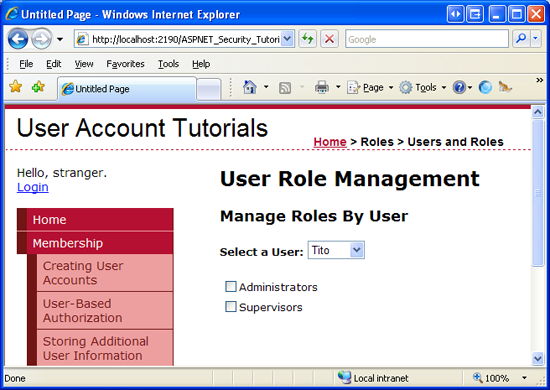](assigning-roles-to-users-vb/_static/image4.png)

**Figure 2**: The Page Displays the Users and Roles  ([Click to view full-size image](assigning-roles-to-users-vb/_static/image6.png))

### Checking the Roles the Selected User Belongs To

When the page is first loaded, or whenever the visitor selects a new user from the drop-down list, we need to update the `UsersRoleList`'s checkboxes so that a given role checkbox is checked only if the selected user belongs to that role. To accomplish this, create a method named `CheckRolesForSelectedUser` with the following code:

    Private Sub CheckRolesForSelectedUser() 
         ' Determine what roles the selected user belongs to 
         Dim selectedUserName As String = UserList.SelectedValue 
         Dim selectedUsersRoles() As String = Roles.GetRolesForUser(selectedUserName) 
     
         ' Loop through the Repeater's Items and check or uncheck the checkbox as needed 
         For Each ri As RepeaterItem In UsersRoleList.Items 
              ' Programmatically reference the CheckBox 
              Dim RoleCheckBox As CheckBox = CType(ri.FindControl("RoleCheckBox"), CheckBox) 
              ' See if RoleCheckBox.Text is in selectedUsersRoles 
              If Linq.Enumerable.Contains(Of String)(selectedUsersRoles, RoleCheckBox.Text) Then 
                   RoleCheckBox.Checked = True 
              Else 
                   RoleCheckBox.Checked = False 
              End If 
         Next 
    End Sub

The above code starts by determining who the selected user is. It then uses the Roles class's [`GetRolesForUser(userName)` method](https://msdn.microsoft.com/en-us/library/system.web.security.roles.getrolesforuser.aspx) to return the specified user's set of roles as a string array. Next, the Repeater's items are enumerated and each item's `RoleCheckBox` CheckBox is programmatically referenced. The CheckBox is checked only if the role it corresponds to is contained within the `selectedUsersRoles` string array.

> [!NOTE] The `Linq.Enumerable.Contains(Of String)(...)` syntax will not compile if you are using ASP.NET version 2.0. The `Contains(Of String)` method is part of the [LINQ library](http://en.wikipedia.org/wiki/Language_Integrated_Query), which is new to ASP.NET 3.5. If you are still using ASP.NET version 2.0, use the [`Array.IndexOf(Of String)` method](https://msdn.microsoft.com/en-us/library/eha9t187.aspx) instead.

The `CheckRolesForSelectedUser` method needs to be called in two cases: when the page is first loaded and whenever the `UserList` DropDownList's selected index is changed. Therefore, call this method from the `Page_Load` event handler (after the calls to `BindUsersToUserList` and `BindRolesToList`). Also, create an event handler for the DropDownList's `SelectedIndexChanged` event and call this method from there.

    Protected Sub Page_Load(ByVal sender As Object,ByVal e As System.EventArgs) Handles Me.Load 
         If Not Page.IsPostBack Then 
              ' Bind the users and roles 
              BindUsersToUserList() 
              BindRolesToList() 
              ' Check the selected user's roles 
              CheckRolesForSelectedUser() 
         End If 
    End Sub 
     
    ... 
     
    Protected Sub UserList_SelectedIndexChanged(ByVal sender As Object,ByVal e As System.EventArgs) Handles UserList.SelectedIndexChanged 
         CheckRolesForSelectedUser() 
    End Sub

With this code in place, you can test the page through the browser. However, since the `UsersAndRoles.aspx` page currently lacks the ability to assign users to roles, no users have roles. We will create the interface for assigning users to roles in a moment, so you can either take my word that this code works and verify that it does so later, or you can manually add users to roles by inserting records into the `aspnet_UsersInRoles` table in order to test this functionality now.

### Assigning and Removing Users from Roles

When the visitor checks or unchecks a CheckBox in the `UsersRoleList` Repeater we need to add or remove the selected user from the corresponding role. The CheckBox's `AutoPostBack` property is currently set to True, which causes a postback anytime a CheckBox in the Repeater is checked or unchecked. In short, we need to create an event handler for the CheckBox's `CheckChanged` event. Since the CheckBox is in a Repeater control, we need to manually add the event handler plumbing. Start by adding the event handler to the code-behind class as a `Protected` method, like so:

    Protected Sub RoleCheckBox_CheckChanged(ByVal sender As Object, ByVal e As EventArgs) 
     
    End Sub

We will return to write the code for this event handler in a moment. But first let's complete the event handling plumbing. From the CheckBox within the Repeater's `ItemTemplate`, add `OnCheckedChanged="RoleCheckBox_CheckChanged"`. This syntax wires the `RoleCheckBox_CheckChanged` event handler to the `RoleCheckBox`'s `CheckedChanged` event.

    <asp:CheckBox runat="server" ID="RoleCheckBox" 
         AutoPostBack="true" 
         Text='<%# Container.DataItem %>' 
         OnCheckedChanged="RoleCheckBox_CheckChanged" />

Our final task is to complete the `RoleCheckBox_CheckChanged` event handler. We need to start by referencing the CheckBox control that raised the event because this CheckBox instance tells us what role was checked or unchecked via its `Text` and `Checked` properties. Using this information along with the UserName of the selected user, we add or remove the user from the role via the `Roles` class's [`AddUserToRole`](https://msdn.microsoft.com/en-us/library/system.web.security.roles.addusertorole.aspx) or [`RemoveUserFromRole` method](https://msdn.microsoft.com/en-us/library/system.web.security.roles.removeuserfromrole.aspx).

    Protected Sub RoleCheckBox_CheckChanged(ByVal sender As Object, ByVal e As EventArgs) 
         'Reference the CheckBox that raised this event 
         Dim RoleCheckBox As CheckBox = CType(sender, CheckBox) 
     
         ' Get the currently selected user and role 
         Dim selectedUserName As String = UserList.SelectedValue 
         Dim roleName As String = RoleCheckBox.Text 
     
         ' Determine if we need to add or remove the user from this role 
         If RoleCheckBox.Checked Then 
              ' Add the user to the role 
              Roles.AddUserToRole(selectedUserName, roleName) 
              ' Display a status message 
              ActionStatus.Text = String.Format("User {0} was added to role {1}.", selectedUserName,roleName) 
         Else 
              ' Remove the user from the role 
              Roles.RemoveUserFromRole(selectedUserName, roleName) 
              ' Display a status message 
              ActionStatus.Text = String.Format("User {0} was removed from role {1}.", selectedUserName,roleName) 
         End If 
    End Sub

The above code starts by programmatically referencing the CheckBox that raised the event, which is available via the `sender` input parameter. If the CheckBox is checked, the selected user is added to the specified role, otherwise they are removed from the role. In either case, the `ActionStatus` Label displays a message summarizing the action just performed.

Take a moment to test out this page through a browser. Select user Tito and then add Tito to both the Administrators and Supervisors roles.

[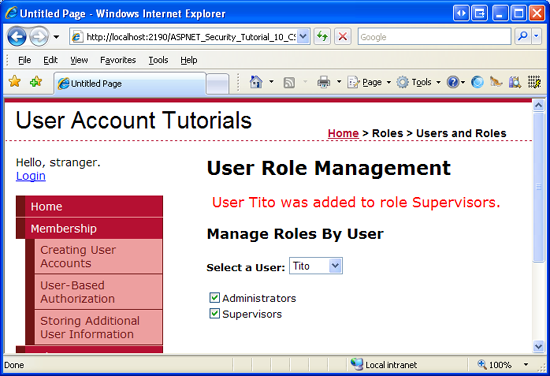](assigning-roles-to-users-vb/_static/image7.png)

**Figure 3**: Tito Has Been Added to the Administrators and Supervisors Roles  ([Click to view full-size image](assigning-roles-to-users-vb/_static/image9.png))

Next, select user Bruce from the drop-down list. There is a postback and the Repeater's CheckBoxes are updated via the `CheckRolesForSelectedUser`. Since Bruce does not yet belong to any roles, the two checkboxes are unchecked. Next, add Bruce to the Supervisors role.

[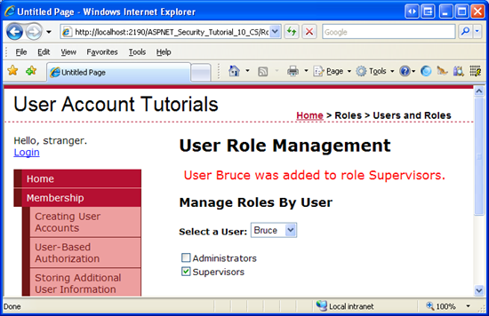](assigning-roles-to-users-vb/_static/image10.png)

**Figure 4**: Bruce Has Been Added to the Supervisors Role  ([Click to view full-size image](assigning-roles-to-users-vb/_static/image12.png))

To further verify the functionality of the `CheckRolesForSelectedUser` method, select a user other than Tito or Bruce. Note how the checkboxes are automatically unchecked, denoting that they do not belong to any roles. Return to Tito. Both the Administrators and Supervisors checkboxes should be checked.

## Step 2: Building the "By Roles" User Interface

At this point we have completed the "by users" interface and are ready to start tackling the "by roles" interface. The "by roles" interface prompts the user to select a role from a drop-down list and then displays the set of users that belong to that role in a GridView.

Add another DropDownList control to the `UsersAndRoles.aspx page`. Place this one beneath the Repeater control, name it `RoleList`, and set its `AutoPostBack` property to True. Underneath that, add a GridView and name it `RolesUserList`. This GridView will list the users that belong to the selected role. Set the GridView's `AutoGenerateColumns` property to False, add a TemplateField to the grid's `Columns` collection, and set its `HeaderText` property to "Users". Define the TemplateField's `ItemTemplate` so that it displays the value of the databinding expression `Container.DataItem` in the `Text` property of a Label named `UserNameLabel`.

After adding and configuring the GridView, your "by role" interface's declarative markup should look similar to the following:

    <h3>Manage Users By Role</h3> 
    
 
         <b>Select a Role:</b> 
         <asp:DropDownList ID="RoleList" runat="server" AutoPostBack="true"></asp:DropDownList> 
    
 
    
 
         <asp:GridView ID="RolesUserList" runat="server" AutoGenerateColumns="false" 
              EmptyDataText="No users belong to this role."> 
              <Columns> 
                   <asp:TemplateField HeaderText="Users"> 
                        <ItemTemplate> 
                             <asp:Label runat="server" id="UserNameLabel" 
                                  Text='<%# Container.DataItem %>'></asp:Label> 
                        </ItemTemplate> 
                   </asp:TemplateField> 
              </Columns> 
         </asp:GridView> 
    

We need to populate the `RoleList` DropDownList with the set of roles in the system. To accomplish this, update the `BindRolesToList` method so that is binds the string array returned by the `Roles.GetAllRoles` method to the `RolesList` DropDownList (as well as the `UsersRoleList` Repeater).

    Private Sub BindRolesToList() 
         ' Get all of the roles 
         Dim roleNames() As String = Roles.GetAllRoles() 
         UsersRoleList.DataSource = roleNames 
         UsersRoleList.DataBind() 
     
         RoleList.DataSource = roleNames 
         RoleList.DataBind() 
    End Sub

The last two lines in the `BindRolesToList` method have been added to bind the set of roles to the `RoleList` DropDownList control. Figure 5 shows the end result when viewed through a browser – a drop-down list populated with the system's roles.

[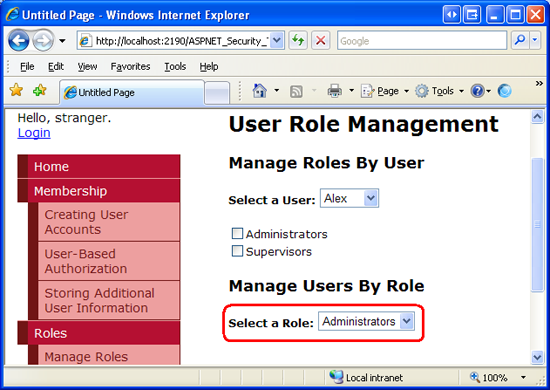](assigning-roles-to-users-vb/_static/image13.png)

**Figure 5**: The Roles are Displayed in the `RoleList` DropDownList  ([Click to view full-size image](assigning-roles-to-users-vb/_static/image15.png))

### Displaying the Users That Belong To the Selected Role

When the page is first loaded, or when a new role is selected from the `RoleList` DropDownList, we need to display the list of users that belong to that role in the GridView. Create a method named `DisplayUsersBelongingToRole` using the following code:

    Private Sub DisplayUsersBelongingToRole() 
         ' Get the selected role 
         Dim selectedRoleName As String = RoleList.SelectedValue 
     
         ' Get the list of usernames that belong to the role 
         Dim usersBelongingToRole() As String = Roles.GetUsersInRole(selectedRoleName) 
     
         ' Bind the list of users to the GridView 
         RolesUserList.DataSource = usersBelongingToRole 
         RolesUserList.DataBind() 
    End Sub

This method starts by getting the selected role from the `RoleList` DropDownList. It then uses the [`Roles.GetUsersInRole(roleName)` method](https://msdn.microsoft.com/en-us/library/system.web.security.roles.getusersinrole.aspx) to retrieve a string array of the UserNames of the users that belong to that role. This array is then bound to the `RolesUserList` GridView.

This method needs to be called in two circumstances: when the page is initially loaded and when the selected role in the `RoleList` DropDownList changes. Therefore, update the `Page_Load` event handler so that this method is invoked after the call to `CheckRolesForSelectedUser`. Next, create an event handler for the `RoleList`'s `SelectedIndexChanged` event, and call this method from there, too.

    Protected Sub Page_Load(ByVal sender As Object, ByVal e As System.EventArgs) Handles Me.Load 
         If Not Page.IsPostBack Then 
              ' Bind the users and roles 
              BindUsersToUserList() 
              BindRolesToList() 
     
              ' Check the selected user's roles 
              CheckRolesForSelectedUser() 
     
              'Display those users belonging to the currently selected role 
              DisplayUsersBelongingToRole() 
         End If 
    End Sub 
     
    ... 
     
    Protected Sub RoleList_SelectedIndexChanged(ByVal sender As Object, ByVal e As System.EventArgs) Handles RoleList.SelectedIndexChanged 
         DisplayUsersBelongingToRole() 
    End Sub

With this code in place, the `RolesUserList` GridView should display those users that belong to the selected role. As Figure 6 shows, the Supervisors role consists of two members: Bruce and Tito.

[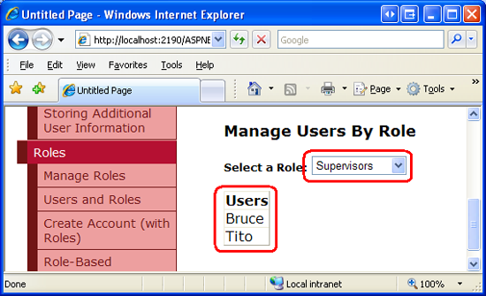](assigning-roles-to-users-vb/_static/image16.png)

**Figure 6**: The GridView Lists Those Users That Belong to the Selected Role  ([Click to view full-size image](assigning-roles-to-users-vb/_static/image18.png))

### Removing Users from the Selected Role

Let's augment the `RolesUserList` GridView so that it includes a column of "Remove" buttons. Clicking the "Remove" button for a particular user will remove them from that role.

Start by adding a Delete button field to the GridView. Make this field appear as the left most filed and change its `DeleteText` property from "Delete" (the default) to "Remove".

[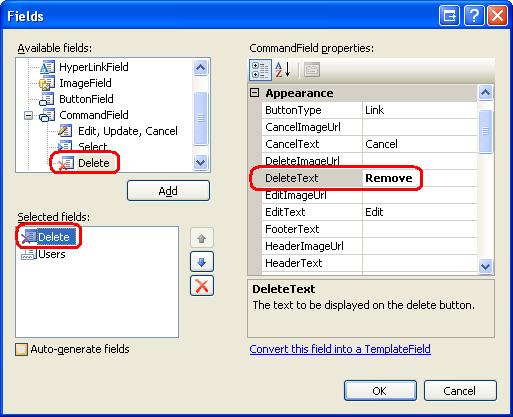](assigning-roles-to-users-vb/_static/image19.png)

**Figure 7**: Add the "Remove" Button to the GridView  ([Click to view full-size image](assigning-roles-to-users-vb/_static/image21.png))

When the "Remove" button is clicked a postback ensues and the GridView's `RowDeleting` event is raised. We need to create an event handler for this event and write code that removes the user from the selected role. Create the event handler and then add the following code:

    Protected Sub RolesUserList_RowDeleting(ByVal sender As Object, ByVal e As System.Web.UI.WebControls.GridViewDeleteEventArgs) Handles RolesUserList.RowDeleting 
         ' Get the selected role 
         Dim selectedRoleName As String = RoleList.SelectedValue 
     
         ' Reference the UserNameLabel 
         Dim UserNameLabel As Label = CType(RolesUserList.Rows(e.RowIndex).FindControl("UserNameLabel"),Label) 
     
         ' Remove the user from the role 
         Roles.RemoveUserFromRole(UserNameLabel.Text, selectedRoleName) 
     
         ' Refresh the GridView 
         DisplayUsersBelongingToRole() 
     
         ' Display a status message 
         ActionStatus.Text = String.Format("User {0} was removed from role {1}.", UserNameLabel.Text,selectedRoleName) 
    End Sub

The code starts by determining the selected role name. It then programmatically references the `UserNameLabel` control from the row whose "Remove" button was clicked in order to determine the UserName of the user to remove. The user is then removed from the role via a call to the `Roles.RemoveUserFromRole` method. The `RolesUserList` GridView is then refreshed and a message is displayed via the `ActionStatus` Label control.

> [!NOTE] The "Remove" button does not require any sort of confirmation from the user before removing the user from the role. I invite you to add some level of user confirmation. One of the easiest ways to confirm an action is through a client-side confirm dialog box. For more information on this technique, see [Adding Client-Side Confirmation When Deleting](https://asp.net/learn/data-access/tutorial-42-vb.aspx).

Figure 8 shows the page after user Tito has been removed from the Supervisors group.

[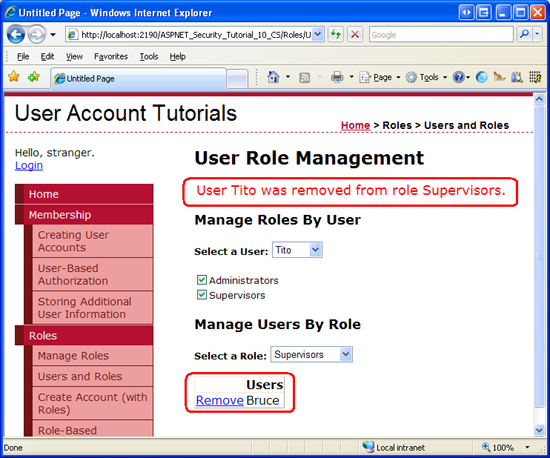](assigning-roles-to-users-vb/_static/image22.png)

**Figure 8**: Alas, Tito is No Longer a Supervisor  ([Click to view full-size image](assigning-roles-to-users-vb/_static/image24.png))

### Adding New Users to the Selected Role

Along with removing users from the selected role, the visitor to this page should also be able to add a user to the selected role. The best interface for adding a user to the selected role depends on the number of user accounts you expect to have. If your website will house just a few dozen user accounts or less, you could use a DropDownList here. If there might be thousands of user accounts, you would want to include a user interface that permits the visitor to page through the accounts, search for a particular account, or filter the user accounts in some other fashion.

For this page let's use a very simple interface that works regardless of the number of user accounts in the system. Namely, we will use a TextBox, prompting the visitor to type in the username of the user she wants to add to the selected role. If no user with that name exists, or if the user is already a member of the role, we'll display a message in `ActionStatus` Label. But if the user exists and is not a member of the role, we'll add them to the role and refresh the grid.

Add a TextBox and Button beneath the GridView. Set the TextBox's `ID` to `UserNameToAddToRole` and set the Button's `ID` and `Text` properties to `AddUserToRoleButton` and "Add User to Role", respectively.

    
 
         <b>UserName:</b> 
         <asp:TextBox ID="UserNameToAddToRole" runat="server"></asp:TextBox> 
           
         <asp:Button ID="AddUserToRoleButton" runat="server" Text="Add User to Role" /> 
    

Next, create a `Click` event handler for the `AddUserToRoleButton` and add the following code:

    Protected Sub AddUserToRoleButton_Click(ByVal sender As Object, ByVal e As System.EventArgs) Handles AddUserToRoleButton.Click 
         ' Get the selected role and username 
         Dim selectedRoleName As String = RoleList.SelectedValue 
         Dim userToAddToRole As String = UserNameToAddToRole.Text 
     
         ' Make sure that a value was entered 
         If userToAddToRole.Trim().Length = 0 Then 
              ActionStatus.Text = "You must enter a username in the textbox." 
              Exit Sub 
         End If 
     
         ' Make sure that the user exists in the system 
         Dim userInfo As MembershipUser = Membership.GetUser(userToAddToRole) 
         If userInfo Is Nothing Then 
              ActionStatus.Text = String.Format("The user {0} does not exist in the system.",userNameToAddToRole) 
              Exit Sub 
         End If 
     
         ' Make sure that the user doesn't already belong to this role 
         If Roles.IsUserInRole(userToAddToRole, selectedRoleName) Then 
              ActionStatus.Text = String.Format("User {0} already is a member of role {1}.", UserNameToAddToRole,selectedRoleName) 
              Exit Sub 
         End If 
     
         ' If we reach here, we need to add the user to the role 
         Roles.AddUserToRole(userToAddToRole, selectedRoleName) 
     
         ' Clear out the TextBox 
         userNameToAddToRole.Text = String.Empty 
     
         ' Refresh the GridView 
         DisplayUsersBelongingToRole() 
     
         ' Display a status message 
         ActionStatus.Text = String.Format("User {0} was added to role {1}.", UserNameToAddToRole,selectedRoleName) 
    End Sub

The majority of the code in the `Click` event handler performs various validation checks. It ensures that the visitor supplied a username in the `UserNameToAddToRole` TextBox, that the user exists in the system, and that they don't already belong to the selected role. If any of these checks fails, an appropriate message is displayed in `ActionStatus` and the event handler is exited. If all of the checks pass, the user is added to the role via the `Roles.AddUserToRole` method. Following that, the TextBox's `Text` property is cleared out, the GridView is refreshed, and the `ActionStatus` Label displays a message indicating that the specified user was successfully added to the selected role.

> [!NOTE] To ensure that the specified user does not already belong to the selected role, we use the [`Roles.IsUserInRole(userName, roleName)` method](https://msdn.microsoft.com/en-us/library/system.web.security.roles.isuserinrole.aspx), which returns a Boolean value indicating whether *userName* is a member of *roleName*. We will use this method again in the [next tutorial](role-based-authorization-vb.md) when we look at role-based authorization.

Visit the page through a browser and select the Supervisors role from the `RoleList` DropDownList. Try entering an invalid username – you should see a message explaining that the user does not exist in the system.

[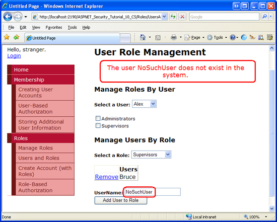](assigning-roles-to-users-vb/_static/image25.png)

**Figure 9**: You Cannot Add a Non-Existent User to a Role  ([Click to view full-size image](assigning-roles-to-users-vb/_static/image27.png))

Now try adding a valid user. Go ahead and re-add Tito to the Supervisors role.

**Figure 10**: Tito Is Once Again a Supervisor!  ([Click to view full-size image](assigning-roles-to-users-vb/_static/image30.png))

## Step 3: Cross-Updating the "By User" and "By Role" Interfaces

The `UsersAndRoles.aspx` page offers two distinct interfaces for managing users and roles. Currently, these two interfaces act independently of one another so it is possible that a change made in one interface will not be reflected immediately in the other. For example, imagine that the visitor to the page selects the Supervisors role from the `RoleList` DropDownList, which lists Bruce and Tito as its members. Next, the visitor selects Tito from the `UserList` DropDownList, which checks the Administrators and Supervisors checkboxes in the `UsersRoleList` Repeater. If the visitor then unchecks the Supervisor role from the Repeater, Tito is removed from the Supervisors role, but this modification is not reflected in the "by role" interface. The GridView will still show Tito as being a member of the Supervisors role.

To fix this we need to refresh the GridView whenever a role is checked or unchecked from the `UsersRoleList` Repeater. Likewise, we need to refresh the Repeater whenever a user is removed or added to a role from the "by role" interface.

The Repeater in the "by user" interface is refreshed by calling the `CheckRolesForSelectedUser` method. The "by role" interface can be modified in the `RolesUserList` GridView's `RowDeleting` event handler and the `AddUserToRoleButton` Button's `Click` event handler. Therefore, we need to call the `CheckRolesForSelectedUser` method from each of these methods.

    Protected Sub RolesUserList_RowDeleting(ByVal sender As Object, ByVal e As System.Web.UI.WebControls.GridViewDeleteEventArgs) Handles RolesUserList.RowDeleting 
         ... Code removed for brevity ... 
     
         ' Refresh the "by user" interface 
         CheckRolesForSelectedUser() 
    End Sub 
     
    Protected Sub AddUserToRoleButton_Click(ByVal sender As Object, ByVal e As System.EventArgs) Handles AddUserToRoleButton.Click 
         ... Code removed for brevity ... 
     
         ' Refresh the "by user" interface 
         CheckRolesForSelectedUser() 
    End Sub

Similarly, the GridView in the "by role" interface is refreshed by calling the `DisplayUsersBelongingToRole` method and the "by user" interface is modified through the `RoleCheckBox_CheckChanged` event handler. Therefore, we need to call the `DisplayUsersBelongingToRole` method from this event handler.

    Protected Sub RoleCheckBox_CheckChanged(ByVal sender As Object, ByVal e As EventArgs) 
         ... Code removed for brevity ... 
     
         ' Refresh the "by role" interface 
         DisplayUsersBelongingToRole() 
    End Sub

With these minor code changes, the "by user" and "by role" interfaces now correctly cross-update. To verify this, visit the page through a browser and select Tito and Supervisors from the `UserList` and `RoleList` DropDownLists, respectively. Note that as you uncheck the Supervisors role for Tito from the Repeater in the "by user" interface, Tito is automatically removed from the GridView in the "by role" interface. Adding Tito back to the Supervisors role from the "by role" interface automatically re-checks the Supervisors checkbox in the "by user" interface.

## Step 4: Customizing the CreateUserWizard to Include a "Specify Roles" Step

In the [*Creating User Accounts*](../membership/creating-user-accounts-vb.md) tutorial we saw how to use the CreateUserWizard Web control to provide an interface for creating a new user account. The CreateUserWizard control can be used in one of two ways:

- As a means for visitors to create their own user account on the site, and
- As a means for administrators to create new accounts

In the first use case, a visitor comes to the site and fills out the CreateUserWizard, entering their information in order to register on the site. In the second case, an administrator creates a new account for another person.

When an account is being created by an administrator for some other person, it might be helpful to allow the administrator to specify what roles the new user account belongs to. In the [*Storing* *Additional User Information*](../membership/storing-additional-user-information-vb.md) tutorial we saw how to customize the CreateUserWizard by adding additional `WizardSteps`. Let's look at how to add an additional step to the CreateUserWizard in order to specify the new user's roles.

Open the `CreateUserWizardWithRoles.aspx` page and add a CreateUserWizard control named `RegisterUserWithRoles`. Set the control's `ContinueDestinationPageUrl` property to "~/Default.aspx". Because the idea here is that an administrator will be using this CreateUserWizard control to create new user accounts, set the control's `LoginCreatedUser` property to False. This `LoginCreatedUser` property specifies whether the visitor is automatically logged on as the just-created user, and it defaults to True. We set it to False because when an administrator creates a new account we want to keep him signed in as himself.

Next, select the "Add/Remove `WizardSteps`…" option from the CreateUserWizard's Smart Tag and add a new `WizardStep`, setting its `ID` to `SpecifyRolesStep`. Move the `SpecifyRolesStep WizardStep` so that it comes after the "Sign Up for Your New Account" step, but before the "Complete" step. Set the `WizardStep`'s `Title` property to "Specify Roles", its `StepType` property to `Step`, and its `AllowReturn` property to False.

[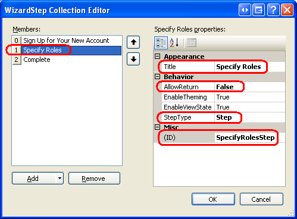](assigning-roles-to-users-vb/_static/image31.png)

**Figure 11**: Add the "Specify Roles" `WizardStep` to the CreateUserWizard  ([Click to view full-size image](assigning-roles-to-users-vb/_static/image33.png))

After this change your CreateUserWizard's declarative markup should look like the following:

    <asp:CreateUserWizard ID="RegisterUserWithRoles" runat="server" 
         ContinueDestinationPageUrl="~/Default.aspx" LoginCreatedUser="False"> 
         <WizardSteps> 
              <asp:CreateUserWizardStep ID="CreateUserWizardStep1" runat="server"> 
              </asp:CreateUserWizardStep> 
              <asp:WizardStep ID="SpecifyRolesStep" runat="server" StepType="Step" 
                   Title="Specify Roles" AllowReturn="False"> 
              </asp:WizardStep> 
              <asp:CompleteWizardStep ID="CompleteWizardStep1" runat="server"> 
              </asp:CompleteWizardStep> 
         </WizardSteps> 
    </asp:CreateUserWizard>

In the "Specify Roles" `WizardStep`, add a CheckBoxList named `RoleList.` This CheckBoxList will list the available roles, enabling the person visiting the page to check what roles the newly created user belongs to.

We are left with two coding tasks: first we must populate the `RoleList` CheckBoxList with the roles in the system; second, we need to add the created user to the selected roles when the user moves from the "Specify Roles" step to the "Complete" step. We can accomplish the first task in the `Page_Load` event handler. The following code programmatically references the `RoleList` CheckBox on the first visit to the page and binds the roles in the system to it.

    Protected Sub Page_Load(ByVal sender As Object, ByVal e As System.EventArgs) Handles Me.Load 
         If Not Page.IsPostBack Then 
              ' Reference the SpecifyRolesStep WizardStep 
              Dim SpecifyRolesStep As WizardStep = CType(RegisterUserWithRoles.FindControl("SpecifyRolesStep"),WizardStep) 
     
              ' Reference the RoleList CheckBoxList 
              Dim RoleList As CheckBoxList = CType(SpecifyRolesStep.FindControl("RoleList"), CheckBoxList) 
     
              ' Bind the set of roles to RoleList 
              RoleList.DataSource = Roles.GetAllRoles() 
              RoleList.DataBind() 
         End If 
    End Sub

The above code should look familiar. In the [*Storing* *Additional User Information*](../membership/storing-additional-user-information-vb.md) tutorial we used two `FindControl` statements to reference a Web control from within a custom `WizardStep`. And the code that binds the roles to the CheckBoxList was taken from earlier in this tutorial.

In order to perform the second programming task we need to know when the "Specify Roles" step has been completed. Recall that the CreateUserWizard has an `ActiveStepChanged` event, which fires each time the visitor navigates from one step to another. Here we can determine if the user has reached the "Complete" step; if so, we need to add the user to the selected roles.

Create an event handler for the `ActiveStepChanged` event and add the following code:

    Protected Sub RegisterUserWithRoles_ActiveStepChanged(ByVal sender As Object, ByVal e As System.EventArgs) Handles RegisterUserWithRoles.ActiveStepChanged 
         'Have we JUST reached the Complete step? 
         If RegisterUserWithRoles.ActiveStep.Title = "Complete" Then 
              ' Reference the SpecifyRolesStep WizardStep 
              Dim SpecifyRolesStep As WizardStep = CType(RegisterUserWithRoles.FindControl("SpecifyRolesStep"),WizardStep) 
     
              ' Reference the RoleList CheckBoxList 
              Dim RoleList As CheckBoxList = CType(SpecifyRolesStep.FindControl("RoleList"), CheckBoxList) 
     
              ' Add the checked roles to the just-added user 
              For Each li As ListItem In RoleList.Items 
                   If li.Selected Then 
                        Roles.AddUserToRole(RegisterUserWithRoles.UserName, li.Text) 
                   End If 
              Next 
         End If 
    End Sub

If the user has just reached the "Completed" step, the event handler enumerates the items of the `RoleList` CheckBoxList and the just-created user is assigned to the selected roles.

Visit this page through a browser. The first step in the CreateUserWizard is the standard "Sign Up for Your New Account" step, which prompts for the new user's username, password, email, and other key information. Enter the information to create a new user named Wanda.

[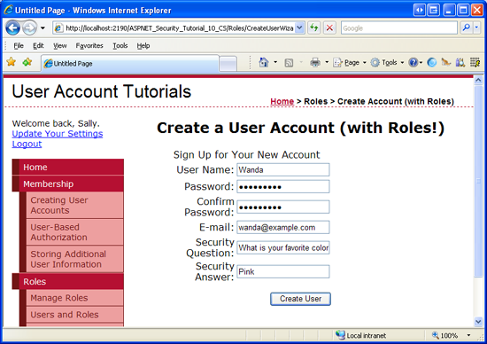](assigning-roles-to-users-vb/_static/image34.png)

**Figure 12**: Create a New User Named Wanda  ([Click to view full-size image](assigning-roles-to-users-vb/_static/image36.png))

Click the "Create User" button. The CreateUserWizard internally calls the `Membership.CreateUser` method, creating the new user account, and then progresses to the next step, "Specify Roles." Here the system roles are listed. Check the Supervisors checkbox and click Next.

[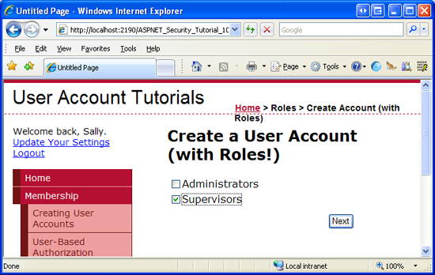](assigning-roles-to-users-vb/_static/image37.png)

**Figure 13**: Make Wanda a Member of the Supervisors Role  ([Click to view full-size image](assigning-roles-to-users-vb/_static/image39.png))

Clicking Next causes a postback and updates the `ActiveStep` to the "Complete" step. In the `ActiveStepChanged` event handler, the recently-created user account is assigned to the Supervisors role. To verify this, return to the `UsersAndRoles.aspx` page and select Supervisors from the `RoleList` DropDownList. As Figure 14 shows, the Supervisors are now made up of three users: Bruce, Tito, and Wanda.

[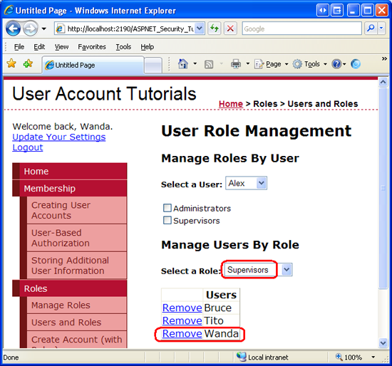](assigning-roles-to-users-vb/_static/image40.png)

**Figure 14**: Bruce, Tito, and Wanda are All Supervisors  ([Click to view full-size image](assigning-roles-to-users-vb/_static/image42.png))

## Summary

The Roles framework offers methods for retrieving information about a particular user's roles and methods for determining what users belong to a specified role. Furthermore, there are a number of methods for adding and removing one or more users to one or more roles. In this tutorial we focused on just two of these methods: `AddUserToRole` and `RemoveUserFromRole`. There are additional variants designed to add multiple users to a single role and to assign multiple roles to a single user.

This tutorial also included a look at extending the CreateUserWizard control to include a `WizardStep` to specify the newly-created user's roles. Such a step could help an administrator streamline the process of creating user accounts for new users.

At this point we have seen how to create and delete roles and how to add and remove users from roles. But we have yet to look at applying role-based authorization. In the [following tutorial](role-based-authorization-vb.md) we will look at defining URL authorization rules on a role-by-role basis, as well as how to limit page-level functionality based on the currently logged in user's roles.

Happy Programming!

### Further Reading

For more information on the topics discussed in this tutorial, refer to the following resources:

- [ASP.NET Web Site Administration Tool Overview](https://msdn.microsoft.com/en-us/library/ms228053.aspx)
- [Examining ASP.NET's Membership, Roles, and Profile](http://aspnet.4guysfromrolla.com/articles/120705-1.aspx)
- [Rolling Your Own Website Administration Tool](http://aspnet.4guysfromrolla.com/articles/052307-1.aspx)

### About the Author

Scott Mitchell, author of multiple ASP/ASP.NET books and founder of 4GuysFromRolla.com, has been working with Microsoft Web technologies since 1998. Scott works as an independent consultant, trainer, and writer. His latest book is *[Sams Teach Yourself ASP.NET 2.0 in 24 Hours](https://www.amazon.com/exec/obidos/ASIN/0672327384/4guysfromrollaco)*. Scott can be reached at [mitchell@4guysfromrolla.com](mailto:mitchell@4guysfromrolla.com) or via his blog at [http://ScottOnWriting.NET](http://scottonwriting.net/).

### Special Thanks To…

This tutorial series was reviewed by many helpful reviewers. Lead reviewer for this tutorial was Teresa Murphy. Interested in reviewing my upcoming MSDN articles? If so, drop me a line at [mitchell@4GuysFromRolla.com](mailto:mitchell@4GuysFromRolla.com)

>[!div class="step-by-step"] [Previous](creating-and-managing-roles-vb.md) [Next](role-based-authorization-vb.md)