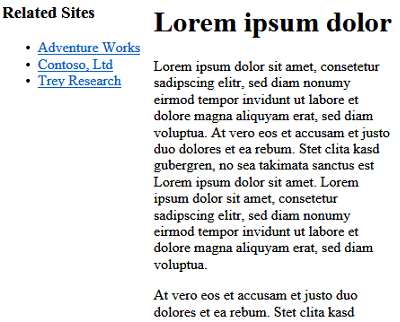
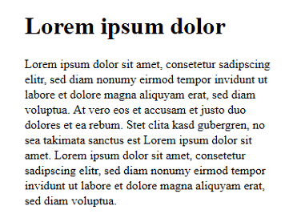

[Edit .md file](C:\Projects\msc\dev\Msc.Www\Web.ASP\App_Data\github\web-pages\overview\mobile\rendering-aspnet-web-pages-sites-for-mobile-devices.md) | [Edit dev content](http://www.aspdev.net/umbraco#/content/content/edit/38610) | [View dev content](http://docs.aspdev.net/tutorials/web-pages/overview/mobile/rendering-aspnet-web-pages-sites-for-mobile-devices.html) | [View prod content](http://www.asp.net/web-pages/overview/mobile/rendering-aspnet-web-pages-sites-for-mobile-devices) | Picker: 59900

Rendering ASP.NET Web Pages (Razor) Sites for Mobile Devices
====================
by [Tom FitzMacken](https://github.com/tfitzmac)

> This article describes how to create pages in an ASP.NET Web Pages (Razor) site that will render appropriately on mobile devices.
> 
> What you'll learn:
> 
> - How to use a naming convention to specify that a page is designed specifically for mobile devices.
>   
> 
> ## Software versions used in the tutorial
> 
> 
> - ASP.NET Web Pages (Razor) 3
>   
> 
> This tutorial also works with ASP.NET Web Pages 2.

ASP.NET Web Pages lets you create custom displays for rendering content on mobile or other devices.

The simplest way to create device-specific page in an ASP.NET Web Pages site is by using a file-naming pattern like this: *FileName.**Mobile**.cshtml*. You can create two versions of a page (for example, one named *MyFile.cshtml* and one named *MyFile.Mobile.cshtml*). At run time, when a mobile device requests *MyFile.cshtml*, ASP.NET renders the content from *MyFile.Mobile.cshtml*. Otherwise, *MyFile.cshtml* is rendered.

The following example shows how to enable mobile rendering by adding a content page for mobile devices. *Page1.cshtml* contains content plus a navigation sidebar. *Page1.Mobile.cshtml* contains the same content, but omits the sidebar.

1. In an ASP.NET Web Pages site, create a file named *Page1.cshtml* and replace the current content with following markup.

        <!DOCTYPE html>
        
        <html lang="en">
            <head>
                <meta charset="utf-8" />
                <title></title>
                
            </head>
            <body>
                
 
                    <h3>Related Sites</h3>
                    <ul>
                        <li><a href="http://www.adventure-works.com/">Adventure Works</a></li>
                        <li><a href="http://www.contoso.com/">Contoso, Ltd</a></li>
                        <li><a href="http://www.treyresearch.net/">Trey Research</a></li>
                    </ul>
                
 
                

                    <h1>Lorem ipsum dolor</h1>
                    
Lorem ipsum dolor sit amet, consetetur sadipscing elitr, sed diam nonumy 
                    eirmod tempor invidunt ut labore et dolore magna aliquyam erat, sed diam voluptua. 
                    At vero eos et accusam et justo duo dolores et ea rebum. Stet clita kasd gubergren, 
                    no sea takimata sanctus est Lorem ipsum dolor sit amet. Lorem ipsum dolor sit 
                    amet, consetetur sadipscing elitr, sed diam nonumy eirmod tempor invidunt ut 
                    labore et dolore magna aliquyam erat, sed diam voluptua. 

                    
At vero eos et accusam et justo duo dolores et ea rebum. Stet clita kasd 
                    gubergren, no sea takimata sanctus est Lorem ipsum dolor sit amet. Lorem ipsum 
                    dolor sit amet, consetetur sadipscing elitr, sed diam nonumy eirmod tempor invidunt 
                    ut labore et dolore magna aliquyam erat, sed diam voluptua. At vero eos et accusam 
                    et justo duo dolores et ea rebum. Stet clita kasd gubergren, no sea takimata 
                    sanctus est Lorem ipsum dolor sit amet.

                

            </body>
        </html>
2. Create a file named *Page1.Mobile.cshtml* and replace the existing content with the following markup. Notice that the mobile version of the page omits the navigation section for better rendering on a smaller screen.

        <!DOCTYPE html>
        
        <html lang="en">
            <head>
                <meta charset="utf-8" />
                <title></title>
                
            </head>
            <body>
                

                    <h1>Lorem ipsum dolor</h1>
                    
Lorem ipsum dolor sit amet, consetetur sadipscing elitr, sed diam nonumy 
                    eirmod tempor invidunt ut labore et dolore magna aliquyam erat, sed diam voluptua. 
                    At vero eos et accusam et justo duo dolores et ea rebum. Stet clita kasd gubergren, 
                    no sea takimata sanctus est Lorem ipsum dolor sit amet. Lorem ipsum dolor sit 
                    amet, consetetur sadipscing elitr, sed diam nonumy eirmod tempor invidunt ut 
                    labore et dolore magna aliquyam erat, sed diam voluptua. 

                    
At vero eos et accusam et justo duo dolores et ea rebum. Stet clita kasd 
                    gubergren, no sea takimata sanctus est Lorem ipsum dolor sit amet. Lorem ipsum 
                    dolor sit amet, consetetur sadipscing elitr, sed diam nonumy eirmod tempor invidunt 
                    ut labore et dolore magna aliquyam erat, sed diam voluptua. At vero eos et accusam 
                    et justo duo dolores et ea rebum. Stet clita kasd gubergren, no sea takimata 
                    sanctus est Lorem ipsum dolor sit amet.

                

            </body>
        </html>
3. Run a desktop browser and browse to *Page1.cshtml*. 
4. Run a mobile browser (or a mobile device emulator) and browse to *Page1.cshtml*. (Notice that you do not include *.mobile.* as part of the URL.) Even though the request is to *Page1.cshtml*, ASP.NET renders *Page1.Mobile.cshtml*.

    

> [!NOTE] To test mobile pages, you can use a mobile device simulator that runs on a desktop computer. This tool lets you test web pages as they would look on mobile devices (that is, typically with a much smaller display area). One example of a simulator is the [User Agent Switcher add-on](http://addons.mozilla.org/en-us/firefox/addon/user-agent-switcher/) for Mozilla Firefox, which lets you emulate various mobile browsers from a desktop version of Firefox.

## Additional Resources

[Windows Phone Emulator](https://msdn.microsoft.com/en-us/library/ff402563(v=VS.92).aspx)