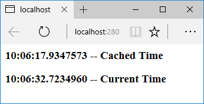

# In memory caching

By [Rick Anderson](https://twitter.com/RickAndMSFT) and [Steve Smith](http://ardalis.com)

[View or download sample code](https://github.com/aspnet/Docs/tree/master/aspnetcore/performance/caching/memory/sample)

<a name=caching-basics></a>

## Caching basics

Caching can significantly improve the performance and scalability of an app by reducing round trips to the data store. Caching works best with data that changes infrequently. Caching makes a copy of data that can be returned much faster than from the original source. You should write and test your app to never depend on cached data.

ASP.NET Core supports several different caches. The simplest cache is based on the [IMemoryCache](https://docs.microsoft.com/en-us/aspnet/core/api/microsoft.extensions.caching.memory.imemorycache), which represents a cache stored in the memory of the web application. Apps that utilize scale out in the cloud (run on multiple servers, that is a server farm), should ensure that sessions are sticky. Sticky sessions ensure that subsequent requests from a client all go to the same server. For example, Azure Web apps use  [Application Request Routing](http://www.iis.net/learn/extensions/planning-for-arr) (ARR) to route all subsequent requests to the same server.

If an app is hosted by multiple servers in a web farm or cloud hosting environment, and you cannot guarantee sticky sessions (that is subsequent requests to the same server), you will not be able to use the in-memory cache. Non-sticky sessions require a [distributed cache](distributed.md) to avoid cache consistency problems. 

For some apps, a [distributed cache](distributed.md) can support higher scale out than an in-memory cache. Using a distributed cache offloads the cache memory to an external process. 

The `IMemoryCache` cache will evict cache entries under memory pressure unless the [cache priority](https://docs.microsoft.com/en-us/aspnet/core/api/microsoft.extensions.caching.memory.cacheitempriority) is set to `CacheItemPriority.NeverRemove`. You can set the [cache priority](https://docs.microsoft.com/en-us/aspnet/core/api/microsoft.extensions.caching.memory.cacheitempriority) to adjust the priority the cache evicts items under memory pressure.

The in-memory cache can store non-serializable objects, the distributed cache requires objects to be serializable.

## Using `IMemoryCache`

In-memory caching is a *service* that is referenced from your app using [Dependency Injection](../../fundamentals/dependency-injection.md). Call `AddMemoryCache` in `ConfigureServices`:

[!code-csharp[Main](memory/sample/WebCache/Startup.cs?highlight=8,9)] 

Request the `IMemoryCache` instance in the constructor:

```c#
  public class HomeController : Controller
  {

      public HomeController(IMemoryCache memoryCache)
      {
          _memoryCache = memoryCache;
      }
```

`IMemoryCache` requires NuGet package "Microsoft.Extensions.Caching.Memory".

The following code uses [TryGetValue](https://docs.microsoft.com/en-us/aspnet/core/api/microsoft.extensions.caching.memory.imemorycache) to cache and fetch the current time:

[!code-csharp[Main](memory/sample/WebCache/Controllers/HomeController.cs?name=snippet1)]

The current time and the cached time is displayed:

[!code-html[Main](memory/sample/webcache/views/home/index.cshtml)]

The `DateTime.Now` value will stay in the cache while there are requests within the timeout period (and not enough memory pressure to evict the cached entry). The image below shows the cached value is older than the current value:



The following code uses [GetOrCreate](https://docs.microsoft.com/en-us/aspnet/core/api/microsoft.extensions.caching.memory.cacheextensions) and [GetOrCreateAsync](https://docs.microsoft.com/en-us/aspnet/core/api/microsoft.extensions.caching.memory.cacheextensions) to cache data. 

[!code-csharp[Main](memory/sample/WebCache/Controllers/HomeController.cs?name=snippet2&highlight=3,13-14)]

The following code calls [Get](https://docs.microsoft.com/en-us/aspnet/core/api/microsoft.extensions.caching.memory.cacheextensions) to fetch the cached time:

[!code-csharp[Main](memory/sample/WebCache/Controllers/HomeController.cs?name=snippet_gct)]

See [IMemoryCache methods](https://docs.microsoft.com/en-us/aspnet/core/api/microsoft.extensions.caching.memory.imemorycache) and [CacheExtensions methods](https://docs.microsoft.com/en-us/aspnet/core/api/microsoft.extensions.caching.memory.cacheextensions) for a description of the cache methods.

## Using `MemoryCacheEntryOptions`

The following sample:

- Sets the absolute expiration time. This is the maximum time the entry can be cached and prevents the item from becoming too stale when the sliding expiration is continuously renewed.
- Sets a sliding expiration time. Requests that access this cached item will reset the sliding expiration clock.
- Sets the [cache priority](https://docs.microsoft.com/en-us/aspnet/core/api/microsoft.extensions.caching.memory.cacheitempriority) to `CacheItemPriority.NeverRemove`. 
- Sets a [PostEvictionDelegate](https://docs.microsoft.com/en-us/aspnet/core/api/microsoft.extensions.caching.memory.postevictiondelegate) that will be called after the entry is evicted from the cache. The callback is run on a different thread from the code that removes the item from the cache.

[!code-csharp[Main](memory/sample/WebCache/Controllers/HomeController.cs?name=snippet_et)]

## Cache dependencies

The following sample shows how to expire a cache entry if a dependent entry expires. A `CancellationTokenSource` is added to the cached item. When `Cancel` is called on the token, both cache entries are evicted. 

[!code-csharp[Main](memory/sample/WebCache/Controllers/HomeController.cs?name=snippet_ed)]

Using a `CancellationTokenSource` allows multiple cache entries to be evicted as a group. With the `using` pattern in the code above, cache entries created inside the `using` block will inherit triggers and timeouts.

### Addition notes

- When using a callback to repopulate a cache item:

  - Multiple requests can find the cached key value empty (because the callback hasn't completed). 
  - This can result in several threads repopulating the cached item.

- When one cache entry is used to create another, the new one copies the existing entry's expiration tokens and time-based expiration settings. The copy is not expired by manual removal or updating of the parent entry.

### Other Resources

* [Response Caching](response.md)
* [Working with a Distributed Cache](distributed.md)
* [Response caching middleware](middleware.md)
